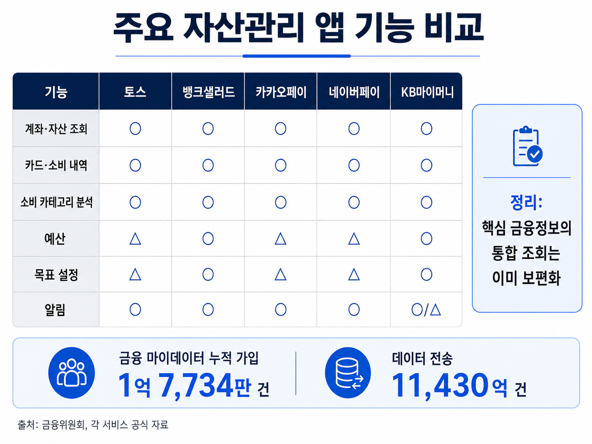
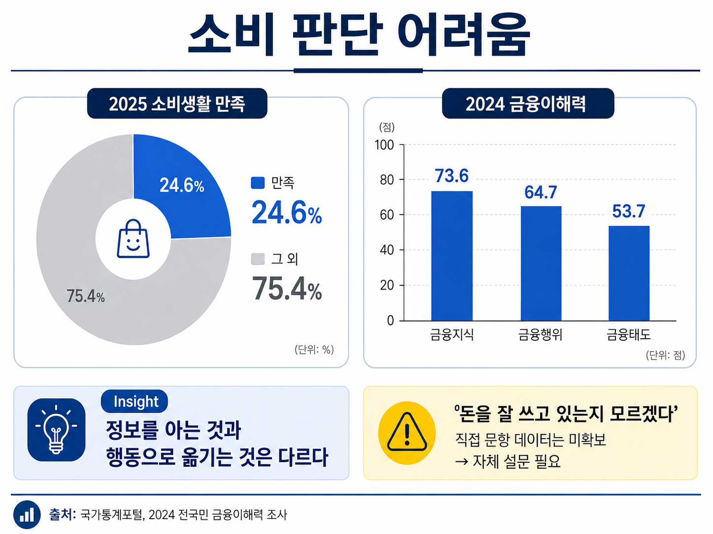
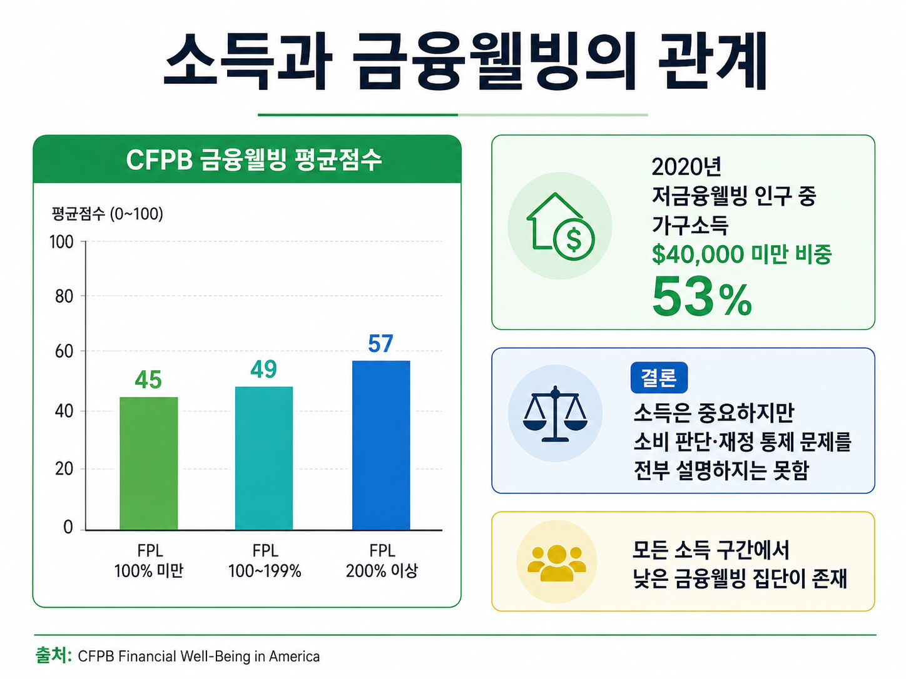
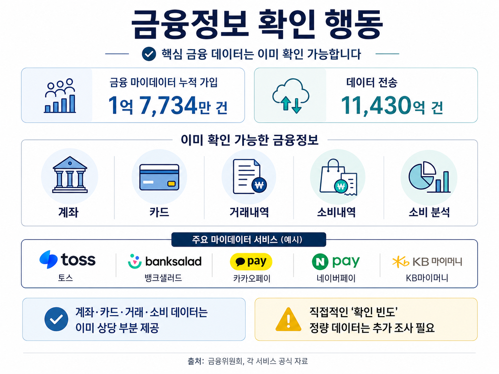
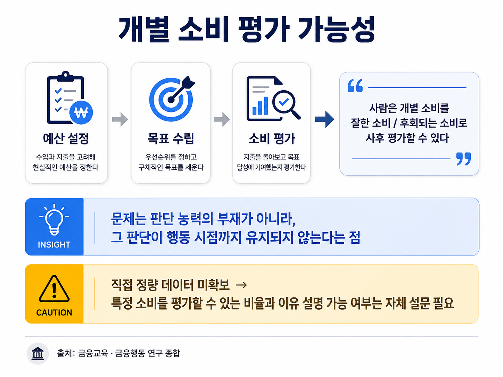
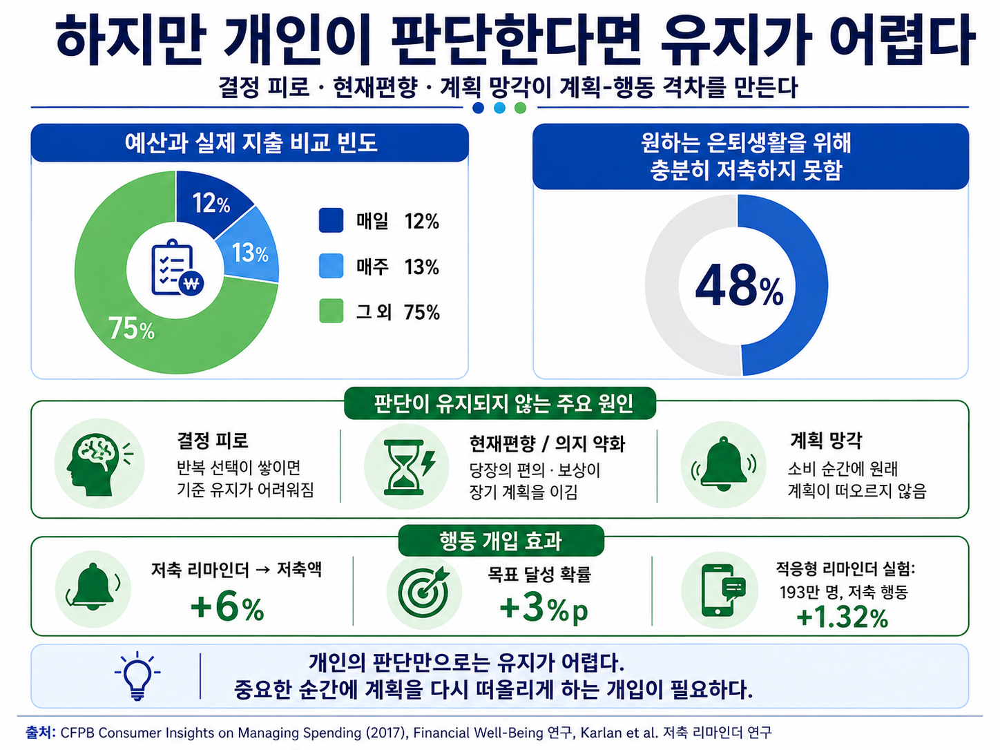
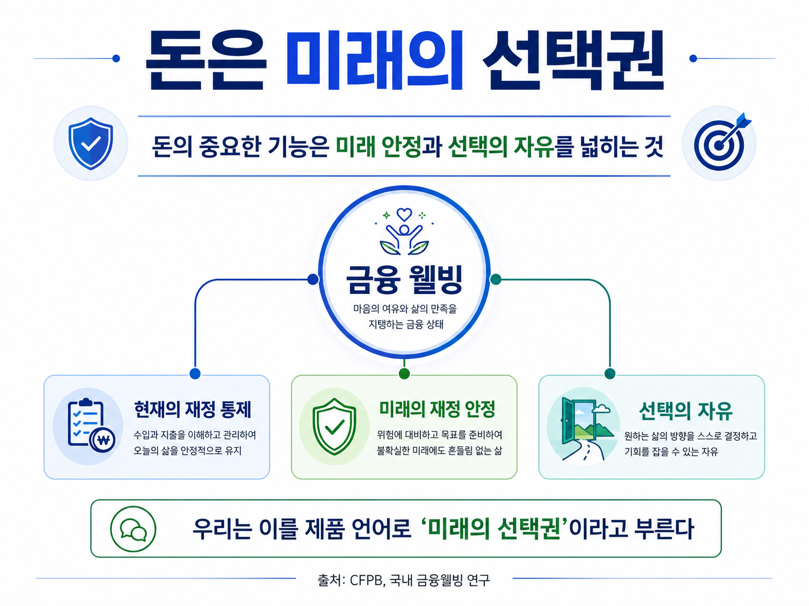
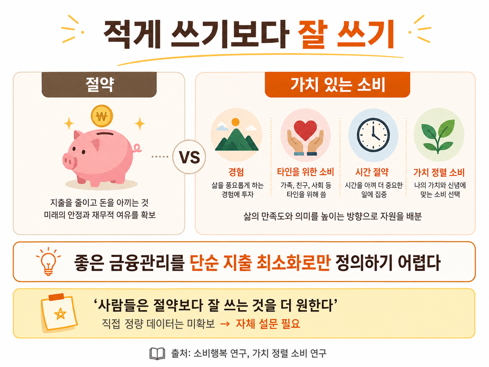
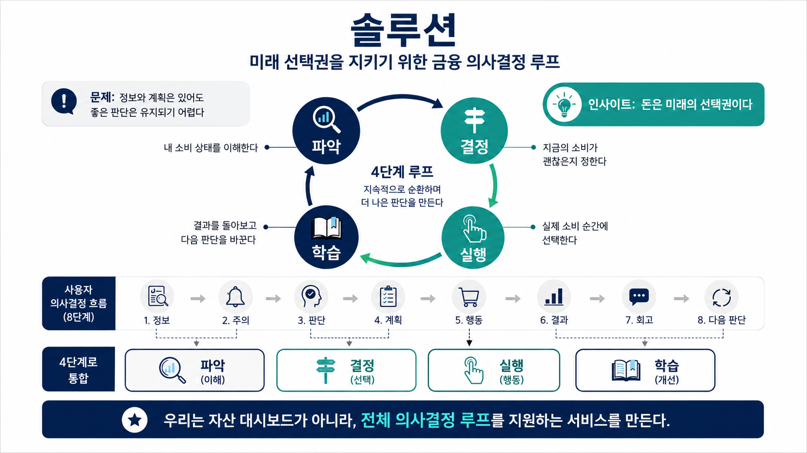
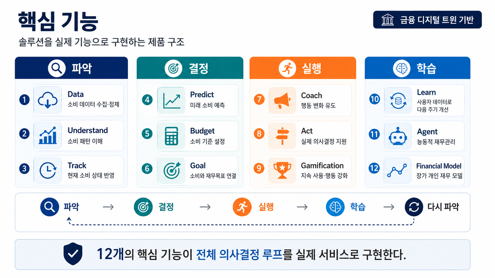

### **문제 정의 (📊: 데이터 검증 필요)**

1. 📊요즘 자산관리 앱은 거의 모든 금융정보를 보여준다
    
    
    
2. 📊그런데도 사람들은 "돈을 잘 쓰고 있는지 모르겠다"고 한다
    
    
    
3. 왜?
    1. 돈이 부족해서?
        1. 📊하지만 소득이 충분한 사람도 사용한다
            
            
            
    2. 그럼 정보를 몰라서?
        1. 📊그런데 계좌·카드·소비 데이터는 이미 다 보여준다
            
            
            
    3. 그럼 사용자가 판단하면 되는 것 아닌가?
        1. 📊실제로 사람은 판단할 수 있다
            
            
            
        2. 📊하지만 개인이 판단한다면 유지가 어렵다(결정 피로/ 계획 수행 의지 저하/ 계획 망각 등 원인)
            
            
            

### **인사이트**

1. 그런데 왜 그렇게 판단을 유지하려 하는가?
2. 📊돈은 미래의 선택권이기 때문이다
    
    
    
3. 소비는 단순한 지출이 아니라 미래 선택권 일부를 현재 선택으로 바꾸는 행동이다
4. 📊그래서 사람은 `적게 쓰는 것`이 아니라 `잘 쓰는 것`을 원한다
    
    
    

### **솔루션**

1. 그러려면 데이터만으로는 부족하다
    
    
    | 흐름 | 사용자가 하는 일 |
    | --- | --- |
    | **파악** | 지금 내 소비가 어떤 상태인지 이해한다 |
    | **결정** | 지금의 소비가 괜찮은지 판단하고 기준을 정한다 |
    | **실행** | 실제 소비 순간에 그 판단대로 행동한다 |
    | **학습** | 결과를 돌아보고 다음 판단을 더 나아지게 만든다 |
    
    
    

### 핵심 기능

| 단계 | 연결 핵심 기능 | 핵심 기능 개별 설명 |
| --- | --- | --- |
| **파악** | **Data** | 계좌·카드·거래 데이터를 수집하고 소비 데이터로 정리한다 |
|  | **Understand** | 카테고리·요일·시간대·상점·빈도 등 소비 패턴을 분석한다 |
|  | **Track** | 현재 소비액, 잔여 예산, 소비 속도 등 지금의 상태를 보여준다 |
| **결정** | **Predict** | 현재 소비 흐름을 바탕으로 월말 지출, 예상 초과액, 예산 소진 시점을 예측한다 |
|  | **Budget** | 사용자가 지키고 싶은 소비 기준을 예산으로 설정한다 |
|  | **Goal** | 현재 소비가 저축·여행·비상금 등 미래 재무목표에 미치는 영향을 연결한다 |
| **실행** | **Coach** | 예산 임박·초과 등 필요한 순간에 경고와 행동 제안을 제공한다 |
|  | **Act** | 구매 여부, 예산 이동, What-if 시뮬레이션 등 실제 의사결정을 지원한다 |
|  | **Gamification** | 목표 달성, Streak, Recovery, Challenge 등을 통해 행동 지속을 강화한다 |
| **학습** | **Learn** | 계획과 실제 소비, 경고에 대한 반응을 분석해 다음 주기의 기준을 개선한다 |
|  | **Agent** | 축적된 데이터를 바탕으로 과소비 위험을 먼저 탐지하고 필요한 행동을 제안한다 |
|  | **Financial Model** | 소득·소비·자산·부채·목표를 장기적으로 통합해 개인의 재무 맥락을 모델링한다 |

