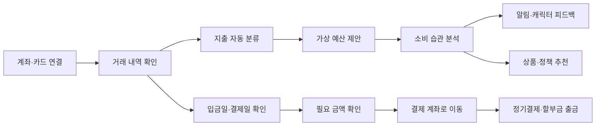

# 개선된 기획 고도화

날짜: 2026년 8월 26일

# 셋업(Setup)

> **소비 습관을 분석하고, 정기 지출 전에 결제 계좌에 필요한 돈을 미리 준비해 주는 서비스**
> 

---

## 해결하려는 문제

### 1. 계획대로 소비하기 어렵다

소비 금액과 시점이 일정하지 않아 이번 달에 얼마를 더 써도 되는지 판단하기 어렵다.

### 2. 결제 계좌를 매번 직접 채워야 한다

월세, 통신비, 보험료, 구독료, 카드 할부금의 출금 계좌가 다르면 결제일마다 잔액을 확인하고 돈을 옮겨야 한다.

### 3. 받을 수 있는 혜택을 놓친다

지원금과 금융 지원 정책이 흩어져 있어 본인에게 맞는 혜택을 찾기 어렵다.

### 4. 줄일 수 있는 비용을 발견하기 어렵다

할부 수수료, 반복 결제, 사용하지 않는 구독처럼 줄일 수 있는 비용이 여러 거래 내역에 흩어져 있다.

---

## 타깃 사용자

**수입 형태나 나이와 관계없이 소비 관리와 결제 계좌 관리가 번거로운 사람**

- 카드와 계좌를 여러 개 사용하는 사람
- 예산을 세워도 지키기 어려운 사람
- 정기결제와 할부금 출 금일을 자주 확인하는 사람
- 자신의 소비 습관을 쉽게 파악하고 싶은 사람

대학생, 취업준비생, 사회초년생을 위한 정책 추천은 **부가 기능**으로 제공한다.

---

## 서비스가 하는 일

### 소비 관리

1. 계좌·카드의 결제 및 이체 내역을 불러온다.
2. 지출을 식비, 교통, 주거, 구독 등으로 자동 분류한다.
3. 소비 내역을 바탕으로 카테고리별 가상 예산을 제안한다.
4. AI가 소비 습관을 분석하고 알림과 캐릭터로 피드백한다.

### 결제 계좌 관리

1. 수입이 들어올 수 있는 날짜와 정기 지출일을 확인한다.
2. 정기결제와 할부금에 필요한 금액을 계산한다.
3. 결제 전에 수입 계좌에서 지정한 결제 계좌로 필요한 금액을 옮긴다.

### 맞춤 추천

1. 사용자 조건에 맞는 지원 정책을 추천한다.
2. 소비 습관에 맞는 금융 상품을 추천한다.
3. 할부 수수료와 불필요한 반복 지출 등 줄일 수 있는 비용을 알려준다.

---

## 핵심 기능 7가지

| 기능 | 내용 |
| --- | --- |
| **가상 예산 설정** | 카테고리별 월 예산을 만들고 남은 금액을 보여준다. 실제 돈을 별도 계좌로 나누는 기능은 아니다. |
| **거래 및 일정 확인** | 카드 결제, 계좌이체, 정기결제, 할부 내역을 모아 소비 내역과 예정된 출금일을 확인한다. |
| **지출 자동 분류** | 거래 내역을 식비, 교통, 주거, 구독 등으로 분류한다. |
| **AI 소비 습관 분석** | 자주 쓰는 항목, 반복 지출, 예산 초과 경향 등 개인의 소비 패턴을 분석한다. |
| **금융 상품·정책 추천** | 소비 분석과 사용자 조건을 바탕으로 도움이 될 수 있는 금융 상품과 지원 정책을 추천한다. |
| **소비 피드백** | 예산 상태와 소비 변화에 따라 알림 메시지와 캐릭터 상태로 피드백을 제공한다. |
| **결제 계좌 자동 준비** | 정기결제, 할부 원금과 수수료가 출금되기 전에 필요한 금액을 수입이 들어오는 계좌에서 사용자가 지정한 결제 계좌로 옮긴다. |

---

## 사용자 흐름

---

## 자동화 범위

셋업이 모든 금융 행동을 대신하는 것은 아니다.

**사용자가 미리 지정한 본인 계좌 사이에서, 정기결제와 할부금에 필요한 돈을 결제 전에 옮기는 것**이 자동화의 핵심이다.

수입 금액을 예측하거나 ‘셀프 월급’을 계산하지 않는다. **수입이 들어올 수 있는 날짜**를 결제 일정과 연결한다.

---

## 최종 정의

> 셋업은 소비를 기록하는 가계부가 아니다.
> 
> 
> **소비 습관을 분석하고, 결제일에 맞춰 필요한 돈을 미리 준비해 주는 생활 금융 관리 서비스다.**
>