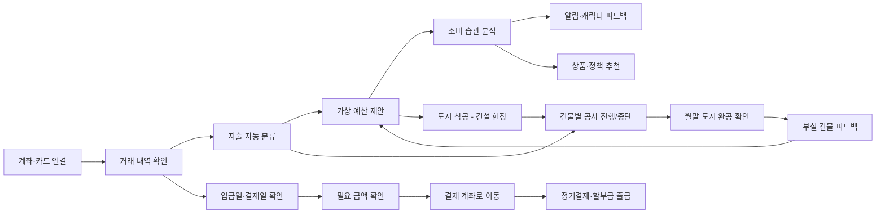

# 개선된 기획 고도화 (게이미피케이션 추가)

날짜: 2026년 8월 27일

# 셋업(Setup)

> **소비 습관을 분석하고, 정기 지출 전에 결제 계좌에 필요한 돈을 미리 준비해 주는 서비스**
>

---

## 해결하려는 문제

### 1. 계획대로 소비하기 어렵다

소비 금액과 시점이 일정하지 않아 이번 달에 얼마를 더 써도 되는지 판단하기 어렵다.

### 2. 결제 계좌를 매번 직접 채워야 한다

월세, 통신비, 보험료, 구독료, 카드 할부금의 출금 계좌가 다르면 결제일마다 잔액을 확인하고 돈을 옮겨야 한다.

### 3. 받을 수 있는 혜택을 놓친다

지원금과 금융 지원 정책이 흩어져 있어 본인에게 맞는 혜택을 찾기 어렵다.

### 4. 줄일 수 있는 비용을 발견하기 어렵다

할부 수수료, 반복 결제, 사용하지 않는 구독처럼 줄일 수 있는 비용이 여러 거래 내역에 흩어져 있다.

### 5. 숫자와 그래프만으로는 소비 관리가 지속되지 않는다

가계부의 숫자 피드백은 며칠 보다가 지치기 쉽다. 한 달의 소비 결과를 직관적으로 보여주고 계속 들어오게 만드는 장치가 없다.

---

## 타깃 사용자

**수입 형태나 나이와 관계없이 소비 관리와 결제 계좌 관리가 번거로운 사람**

- 카드와 계좌를 여러 개 사용하는 사람
- 예산을 세워도 지키기 어려운 사람
- 정기결제와 할부금 출금일을 자주 확인하는 사람
- 자신의 소비 습관을 쉽게 파악하고 싶은 사람

대학생, 취업준비생, 사회초년생을 위한 정책 추천은 **부가 기능**으로 제공한다.

---

## 서비스가 하는 일

### 소비 관리

1. 계좌·카드의 결제 및 이체 내역을 불러온다.
2. 지출을 식비, 교통, 주거, 구독 등으로 자동 분류한다.
3. 소비 내역을 바탕으로 카테고리별 가상 예산을 제안한다.
4. AI가 소비 습관을 분석하고 알림과 캐릭터로 피드백한다.

### 결제 계좌 관리

1. 수입이 들어올 수 있는 날짜와 정기 지출일을 확인한다.
2. 정기결제와 할부금에 필요한 금액을 계산한다.
3. 결제 전에 수입 계좌에서 지정한 결제 계좌로 필요한 금액을 옮긴다.

### 맞춤 추천

1. 사용자 조건에 맞는 지원 정책을 추천한다.
2. 소비 습관에 맞는 금융 상품을 추천한다.
3. 할부 수수료와 불필요한 반복 지출 등 줄일 수 있는 비용을 알려준다.

### 게이미피케이션: 나만의 소비 도시

1. 소비 카테고리를 건물로 표현한 나만의 도시를 만든다.
2. 소비 계획을 지킨 정도에 따라 건물이 지어지거나 빠진다.
3. 한 달이 끝나면 완성된 도시로 그 달의 소비 결과를 확인한다.
4. 부실한 건물을 통해 어느 카테고리가 부족했는지 피드백한다.

---

## 핵심 기능 8가지

| 기능 | 내용 |
| --- | --- |
| **가상 예산 설정** | 카테고리별 월 예산을 만들고 남은 금액을 보여준다. 실제 돈을 별도 계좌로 나누는 기능은 아니다. |
| **거래 및 일정 확인** | 카드 결제, 계좌이체, 정기결제, 할부 내역을 모아 소비 내역과 예정된 출금일을 확인한다. |
| **지출 자동 분류** | 거래 내역을 식비, 교통, 주거, 구독 등으로 분류한다. |
| **AI 소비 습관 분석** | 자주 쓰는 항목, 반복 지출, 예산 초과 경향 등 개인의 소비 패턴을 분석한다. |
| **금융 상품·정책 추천** | 소비 분석과 사용자 조건을 바탕으로 도움이 될 수 있는 금융 상품과 지원 정책을 추천한다. |
| **소비 피드백** | 예산 상태와 소비 변화에 따라 알림 메시지와 캐릭터 상태로 피드백을 제공한다. |
| **결제 계좌 자동 준비** | 정기결제, 할부 원금과 수수료가 출금되기 전에 필요한 금액을 수입이 들어오는 계좌에서 사용자가 지정한 결제 계좌로 옮긴다. |
| **나만의 소비 도시** | 소비 카테고리를 건물로 표현하고, 계획 준수 여부에 따라 건물이 지어지거나 빠지는 도시로 한 달의 소비를 시각화한다. |

---

## 게이미피케이션 상세: 나만의 소비 도시

소비 분석 → 소비 계획 → 종합 피드백으로 이어지는 기존 흐름 위에, 피드백을 **도시 건설**로 시각화하는 층을 얹는다.

### 카테고리 → 건물 매핑

각 소비 카테고리를 하나의 건물로 표현한다.

| 소비 카테고리 | 건물 |
| --- | --- |
| 식비 | 음식점 |
| 교통 | 기차역 |
| 주거 | 주택 |
| 구독 | 극장 |
| 쇼핑 | 백화점 |
| 카페·간식 | 카페 |
| 저축·투자 | 은행 |

*건물 종류와 매핑은 개발 단계에서 카테고리 체계에 맞춰 확정한다.*

### 월 단위 사이클

| 단계 | 시점 | 도시 상태 |
| --- | --- | --- |
| 1. 착공 | 월초 | 소비 계획(카테고리별 가상 예산)이 확정되면 도시가 **건설 현장** 상태로 시작한다. |
| 2. 건설 진행 | 월중 | 카테고리별 예산 준수 상황에 따라 각 건물의 공사가 진행된다. 계획대로 소비하면 건물이 올라가고, 예산을 초과하면 공사가 멈추거나 구조물이 하나씩 빠진다. |
| 3. 완공 확인 | 월말(1달) | 완성된 도시를 확인한다. 잘 지킨 카테고리는 완성된 건물로, 못 지킨 카테고리는 부실 공사(미완성·균열 등)로 남는다. |
| 4. 피드백 | 월말 | 부실한 건물이 곧 피드백이다. "어느 부분이 부족했다"를 건물 상태로 먼저 보여주고, AI 분석이 원인(반복 지출, 예산 초과 경향 등)과 다음 달 계획을 제안한다. |

### 건물 상태 규칙

카테고리별 예산 사용률에 따라 건물 상태가 결정된다.

| 예산 사용률 | 건물 상태 | 의미 |
| --- | --- | --- |
| 계획 이내 (여유) | 성장 | 건물이 완성되고 장식 요소가 추가된다. |
| 계획 근접 | 정상 | 건물이 계획대로 완성된다. |
| 초과 임박 | 주의 | 공사가 멈춘 상태로 경고 표시가 붙는다. |
| 초과 | 부실 | 구조물이 하나씩 빠지고 미완성 상태로 남는다. |

### 월말 피드백 연결

- 월말에 지난달 도시와 이번 달 도시를 **Before / After**로 비교해 변화를 보여준다.
- 부실 건물을 누르면 해당 카테고리의 거래 내역, 초과 원인, 줄일 수 있는 비용(미사용 구독, 할부 수수료 등)으로 바로 연결된다.
- 도시 상태는 별도의 점수가 아니라 **실제 거래 내역과 가상 예산에서 파생 계산**된다. 게임을 위해 새로운 입력을 요구하지 않는다.

### 지속 성장 (완공 이후)

한 달이 끝나도 도시는 초기화되지 않는다. 한번 지어진 건물은 다음 달부터 지속적으로 성장시킬 수 있다.

1. **꾸미기**: 예산을 지킨 달에는 건물을 꾸밀 수 있는 요소(외관, 간판, 주변 조경 등)를 얻는다.
2. **건물 성장**: 같은 카테고리를 여러 달 연속으로 잘 관리하면 건물이 상위 단계로 성장한다. (예: 분식집 → 레스토랑, 간이역 → 중앙역)
3. **쇠퇴**: 여러 달 연속으로 예산을 초과하면 성장한 건물이 단계적으로 되돌아간다. 한 달 실수로 도시 전체가 무너지지는 않게 한다.

### 게이미피케이션의 역할 경계

- 도시는 **피드백의 표현 방식**이지 별도의 게임이 아니다. 도시를 위해 소비를 왜곡하도록 유도하지 않는다.
- 재화 구매, 랭킹 경쟁 등 소비를 부추기는 요소는 넣지 않는다.
- 도시 상태의 근거(어떤 거래가 어떤 상태를 만들었는지)는 항상 확인할 수 있다.

---

## 사용자 흐름

---

## 자동화 범위

셋업이 모든 금융 행동을 대신하는 것은 아니다.

**사용자가 미리 지정한 본인 계좌 사이에서, 정기결제와 할부금에 필요한 돈을 결제 전에 옮기는 것**이 자동화의 핵심이다.

수입 금액을 예측하거나 ‘셀프 월급’을 계산하지 않는다. **수입이 들어올 수 있는 날짜**를 결제 일정과 연결한다.

도시 상태 역시 자동으로 계산된다. 사용자가 게임을 위해 따로 입력하는 것은 없으며, 거래 내역과 가상 예산에서 파생된다.

---

## 최종 정의

> 셋업은 소비를 기록하는 가계부가 아니다.
>
>
> **소비 습관을 분석하고, 결제일에 맞춰 필요한 돈을 미리 준비하며, 한 달의 소비를 나만의 도시로 보여주는 생활 금융 관리 서비스다.**
>
