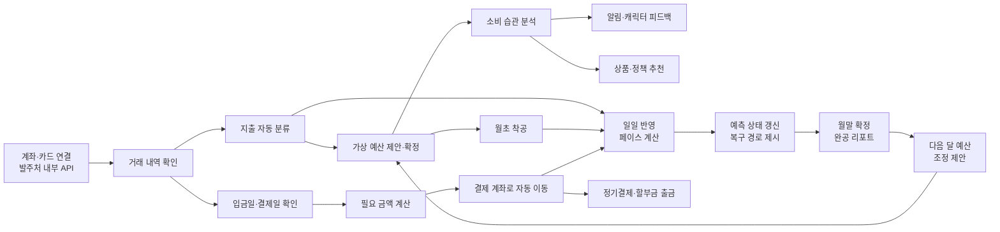

# 개선된 기획 고도화 v2 (리서치 근거·게이미피케이션 설계 반영)

날짜: 2026년 8월 27일

**v1 → v2 변경 사항**
1. 해결하려는 문제에 정량 근거 삽입 (별첨 '리서치 결과 정리' 기반)
2. '시장·경쟁 구도' 섹션 신설 — 구조적 공백, 해외 동향, 선행 사례(Fortune City) 대비 차별점
3. 게이미피케이션 상세를 v2 설계로 교체 — 판정 규칙 정량화, 카테고리 유형 분리, 일일 루프, 복구 메커니즘
4. '프로젝트 범위와 제약' 섹션 신설 — 발주처 내부 API 사용, 실계좌 미연동 명시
5. '성과 지표' 섹션 신설 — 벤치마크 기반 목표선

---

# 셋업(Setup)

> **소비 습관을 분석하고, 정기 지출 전에 결제 계좌에 필요한 돈을 미리 준비해 주는 서비스**

---

## 해결하려는 문제

### 1. 계획대로 소비하기 어렵다

소비 금액과 시점이 일정하지 않아 이번 달에 얼마를 더 써도 되는지 판단하기 어렵다.

> 소비 계획 실패는 고금리 이월로 직결된다. 결제성 리볼빙 이월잔액은 6조 7,288억 원(2026.6)으로 4개월 연속 증가 중이며, 청년 리볼빙 이용자는 25만 6,906명, 월평균 이용금액은 326만 원에 달한다(서민금융진흥원, 2025 청년금융 실태조사).

### 2. 결제 계좌를 매번 직접 채워야 한다

월세, 통신비, 보험료, 구독료, 카드 할부금의 출금 계좌가 다르면 결제일마다 잔액을 확인하고 돈을 옮겨야 한다.

> 자동이체는 잔액이 1원만 부족해도 출금이 실패하고, 카드대금은 5영업일을 넘기면 연체정보가 신용평가사에 공유되어 신용점수가 하락한다(카드사 안내 기준). 현재 시장의 해법은 '출금일 모으기, 알림 이중화' 같은 수동 요령뿐, 돈을 대신 준비해 주는 서비스는 없다.

### 3. 받을 수 있는 혜택을 놓친다

지원금과 금융 지원 정책이 흩어져 있어 본인에게 맞는 혜택을 찾기 어렵다.

> ※ 정량 근거 추가 리서치 예정 (청년 정책 인지율·수급률 통계)

### 4. 줄일 수 있는 비용을 발견하기 어렵다

할부 수수료, 반복 결제, 사용하지 않는 구독처럼 줄일 수 있는 비용이 여러 거래 내역에 흩어져 있다.

> 소비자 94.8%가 구독 서비스 이용 경험이 있고 1인당 3~4개를 구독하며, 월 5만 원 이상 지출자가 46.7%에 이른다(엠브레인, 2025). 구독 서비스 개선 요구 1위는 '어려운 해지 절차'(40.5%, 한국소비자원)이고, 리볼빙 평균 수수료율은 15.1~18.3%다.

### 5. 숫자와 그래프만으로는 소비 관리가 지속되지 않는다

가계부의 숫자 피드백은 며칠 보다가 지치기 쉽다. 한 달의 소비 결과를 직관적으로 보여주고 계속 들어오게 만드는 장치가 없다.

> 금융앱의 30일차 평균 리텐션은 4.2%에 불과하고(Business of Apps), 해외 조사에서 예산 관리 앱 사용자의 73%가 3개월 내에 이탈한다.

---

## 시장·경쟁 구도 (신설)

### 구조적 공백: 마이데이터는 아직 '조회'에 머문다

마이데이터 시행 4년이 지났지만 현행 제도에서 금융 정보는 사실상 조회 용도로만 활용되며, 이를 기반으로 한 자산관리·실행 서비스는 규제 제약으로 나오지 못하고 있다. 금융위원회도 2024년 「마이데이터 2.0 추진 방안」에서 활용 범위의 한계를 공식 인정했다. 즉 "기존 앱이 간단 분석에 머문다"는 것은 개별 앱의 역량 문제가 아니라 **시장 전체의 구조적 공백**이다.

### 국내 경쟁 구도 3유형과 셋업의 위치

| 유형 | 대표 | 하는 것 | 하지 못하는 것 |
| --- | --- | --- | --- |
| 조회·리포트형 | 토스, 뱅크샐러드, 페이북 | 자산 통합 조회, 지출 자동 분류, 예산, 지난달 비교 알림 | 결제 자금의 **사전 준비(실행)**, 지속형 소비 시각화 |
| 리워드 게이미피케이션형 | 인터넷은행 앱테크(만보기, 돈나무 등) | 출석·걷기·게임으로 재방문 유도 (걷기 서비스 반년 250만 이용) | 게임과 **내 소비가 무관** — 소비 행동을 바꾸지 못함 |
| 저축 상품 결합형 | 26주적금, 굴비적금 등 | 저축 습관의 게임화 | 지출 관리·결제 준비 영역 |
| **셋업** | — | **소비 계획 준수의 게임화 + 결제 자금 자동 준비** | — |

국내 소비 피드백은 '지난달 대비 증감 알림' 수준까지는 존재하지만, **예측 → 자금 준비 → 실행 → 지속형 시각화**로 이어지는 서비스는 없다.

### 해외 동향: 방향성은 이미 검증됐다

- **Cleo**: 과거 패턴 기반 지출 예측, 반복 결제 사전 알림, 대화형 AI 소비 피드백, 현금흐름 분석 자동 저축
- **Rocket Money**: 잊힌 구독 자동 탐지 + 앱 내 해지 대행 실행

'분석 → 예측 → 실행'은 글로벌에서 이미 성립한 흐름이며, 국내 마이데이터 환경에는 도입되지 않은 영역이다.

### 직접 선행 사례: Fortune City — 그리고 셋업이 다른 이유

'소비를 도시로 시각화'하는 콘셉트는 대만 Fourdesire의 **Fortune City**(2017 대만·한국·홍콩 구글플레이 올해의 앱, 2018 레드닷 수상)가 선행 사례다. 이 사례는 두 가지를 증명한다.

1. **수요와 리텐션 효과의 검증**: 자동 가계부는 확인하지 않게 되지만 건물 때문에 매일 접속해 지출을 점검하게 된다는 사용자 리뷰가 다수다. '도시가 매일 들어올 이유를 만든다'는 가설은 실사용자 행동으로 입증됐다.
2. **'기록량 보상' 구조의 부작용 확인**: 도시를 키우려고 오히려 지출 욕구가 생긴다는 리뷰가 존재한다. 지출을 기록할수록 도시가 성장하는 구조의 필연적 부작용이다.

| 축 | Fortune City | 셋업 |
| --- | --- | --- |
| 데이터 입력 | 수동 기록 | 계좌·카드 자동 연동 |
| 도시 성장 기준 | **기록 행위** — 많이 쓰고 기록할수록 성장 | **계획 준수** — 예산 안에서 소비해야 완공 |
| 소비 조장 리스크 | 사용자 리뷰로 실재 확인 | 구조적으로 차단 + 비조장 원칙 명문화 |
| 금융 실행 연결 | 없음 | 결제 계좌 자동 준비·비용 절감 제안과 직결 |
| 피드백 깊이 | 기록 통계 | 부실 건물 → 원인 거래 → 다음 달 계획 조정 |

**포지셔닝**: 조회를 넘어 준비와 실행으로, 기록의 게임화를 넘어 **계획 준수의 게임화**로.

---

## 타깃 사용자

**수입 형태나 나이와 관계없이 소비 관리와 결제 계좌 관리가 번거로운 사람**

- 카드와 계좌를 여러 개 사용하는 사람
- 예산을 세워도 지키기 어려운 사람
- 정기결제와 할부금 출금일을 자주 확인하는 사람
- 자신의 소비 습관을 쉽게 파악하고 싶은 사람

대학생, 취업준비생, 사회초년생을 위한 정책 추천은 **부가 기능**으로 제공한다. 청년층은 리볼빙 이용 규모(25.7만 명, 월평균 326만 원)에서 보듯 소비-결제 관리 실패의 비용을 가장 크게 치르는 집단이기도 하다.

---

## 서비스가 하는 일

### 소비 관리

1. 계좌·카드의 결제 및 이체 내역을 불러온다.
2. 지출을 식비, 교통, 주거, 구독 등으로 자동 분류한다.
3. 소비 내역을 바탕으로 카테고리별 가상 예산을 제안한다.
4. AI가 소비 습관을 분석하고 알림과 캐릭터로 피드백한다.

### 결제 계좌 관리

1. 수입이 들어올 수 있는 날짜와 정기 지출일을 확인한다.
2. 정기결제와 할부금에 필요한 금액을 계산한다.
3. 결제 전에 수입 계좌에서 지정한 결제 계좌로 필요한 금액을 옮긴다.

### 맞춤 추천

1. 사용자 조건에 맞는 지원 정책을 추천한다.
2. 소비 습관에 맞는 금융 상품을 추천한다.
3. 할부 수수료와 불필요한 반복 지출 등 줄일 수 있는 비용을 알려준다.

### 게이미피케이션: 나만의 소비 도시

1. 소비 카테고리를 건물로 표현한 나만의 도시를 만든다.
2. 소비 계획을 지킨 정도에 따라 건물이 지어지거나 공사가 멈춘다.
3. 매일의 소비가 도시에 반영되고, 한 달이 끝나면 완성된 도시로 결과를 확인한다.
4. 부실한 건물을 통해 어느 카테고리가 부족했는지 피드백하고 다음 달 계획으로 연결한다.

---

## 핵심 기능 8가지

| 기능 | 내용 |
| --- | --- |
| **가상 예산 설정** | 카테고리별 월 예산을 만들고 남은 금액을 보여준다. 실제 돈을 별도 계좌로 나누는 기능은 아니다. |
| **거래 및 일정 확인** | 카드 결제, 계좌이체, 정기결제, 할부 내역을 모아 소비 내역과 예정된 출금일을 확인한다. |
| **지출 자동 분류** | 거래 내역을 식비, 교통, 주거, 구독 등으로 분류한다. |
| **AI 소비 습관 분석** | 자주 쓰는 항목, 반복 지출, 예산 초과 경향 등 개인의 소비 패턴을 분석한다. |
| **금융 상품·정책 추천** | 소비 분석과 사용자 조건을 바탕으로 도움이 될 수 있는 금융 상품과 지원 정책을 추천한다. |
| **소비 피드백** | 예산 상태와 소비 변화에 따라 알림 메시지와 캐릭터 상태로 피드백을 제공한다. |
| **결제 계좌 자동 준비** | 정기결제, 할부 원금과 수수료가 출금되기 전에 필요한 금액을 수입이 들어오는 계좌에서 사용자가 지정한 결제 계좌로 옮긴다. |
| **나만의 소비 도시** | 소비 카테고리를 건물로 표현하고, 계획 준수 여부에 따라 건물이 지어지거나 공사가 멈추는 도시로 소비를 시각화한다. |

---

## 게이미피케이션 상세: 나만의 소비 도시 (설계 v2)

소비 분석 → 소비 계획 → 종합 피드백 흐름 위에, 피드백을 **도시 건설**로 시각화하는 층을 얹는다.

### 설계 원칙

| 구분 | 원칙 | 내용 |
| --- | --- | --- |
| 유지 | 파생 계산 | 도시 상태는 거래 내역과 가상 예산에서만 계산한다. 게임을 위한 별도 입력은 없다. |
| 유지 | 소비 비조장 | 재화 현금 구매, 랭킹 경쟁을 넣지 않는다. Fortune City에서 확인된 '도시를 키우려 지출하는' 부작용을 구조적으로 차단하기 위함이다. |
| 유지 | 근거 투명성 | 모든 건물 상태에서 원인이 된 거래로 이동할 수 있다. |
| 추가 | 회복 가능성 | 월중 어느 시점에도 "지금부터 어떻게 하면 되는지"를 함께 제시한다. 확정 판정은 월말에만 한다. |
| 추가 | 절약의 가시화 | 줄인 비용(해지한 구독, 완납한 할부)이 도시에 눈에 보이는 형태로 남는다. |

### 핵심 지표: 페이스

| 용어 | 정의 |
| --- | --- |
| 월 진행률 | 이번 달 경과 일수 ÷ 총 일수 |
| 소진률 | 카테고리 누적 지출 ÷ 카테고리 가상 예산 |
| **페이스** | 소진률 ÷ 월 진행률. **1.0 = 계획과 정확히 같은 속도** |

예: 15일차(진행률 50%)에 식비 예산 40% 사용 → 페이스 0.8(여유). 같은 40%라도 5일차라면 페이스 2.4(위험). 단일 '사용률' 규칙으로는 구분할 수 없는 것을 페이스가 구분한다.

### 카테고리 3유형과 건물 매핑

모든 카테고리에 단일 규칙을 적용하면 주거(월세 1건 출금 = 소진률 즉시 100%)와 저축(많이 할수록 좋음)이 오작동한다. 세 유형으로 분리한다.

| 유형 | 카테고리 | 건물 예시 | 판정 방식 |
| --- | --- | --- | --- |
| 변동 소비형 | 식비, 카페·간식, 쇼핑, 교통 | 음식점, 카페, 백화점, 기차역 | 페이스 기반 |
| 고정 지출형 | 주거, 구독, 통신, 보험, 할부 | 주택, 극장 | **이행 여부** 기반 — 결제 계좌 자동 준비와 직결 |
| 적립형 | 저축·투자 | 은행 | 목표 달성률 기반 (방향 반전) |

*건물 종류와 매핑은 개발 단계에서 카테고리 체계에 맞춰 확정한다.*

### 상태 판정 규칙

**변동 소비형 — 월중 예측 상태 (매일 갱신)**

| 페이스 | 예측 상태 | 도시 표현 |
| --- | --- | --- |
| ≤ 0.85 | 성장 예상 | 공사 빠르게 진행, 장식 크레인 |
| 0.85 ~ 1.05 | 정상 | 계획 속도로 공사 |
| 1.05 ~ 1.20 | 주의 | 공사 일시 중단, 점검 표시 |
| > 1.20 | 위험 | 공사 중단, 보수 필요 표시 |

보정 장치: ① 1~5일차는 판정 유보('측량 중') — 거래 한두 건에 페이스가 요동치는 것을 방지. ② 소액 예산 카테고리는 절대 여유액 기준 병행 — 잔여 예산이 평균 1회 결제액 이상이면 강등하지 않음. ③ 임계값(0.85/1.05/1.20)은 초기값이며 A/B 튜닝 대상.

**변동 소비형 — 월말 확정 상태**

| 최종 소진률 | 확정 상태 | 결과 |
| --- | --- | --- |
| ≤ 85% | 성장 | 완공 + 장식 요소(자재) 추가 지급 |
| 85 ~ 100% | 정상 | 계획대로 완공, 자재 지급 |
| 100 ~ 110% | 주의 | 완공되나 외장 마감 없음 |
| > 110% | 부실 | 미완성, 다음 달 보수 대상 |

10% 이내 초과를 '부실'로 규정하지 않는 이유: 가상 예산은 AI 추정치이므로, 근소한 초과를 실패로 판정하면 예산 정확도 문제가 사용자 책임으로 전가되어 판정 신뢰가 무너진다.

**고정 지출형 — 이행 여부 판정 (결제 계좌 자동 준비와 연동)**

| 상태 | 조건 | 건물 표현 |
| --- | --- | --- |
| 준비 완료 | 출금일 전 결제 계좌 이체 완료 | 골조 완성, 안정 |
| 출금 완료 | 예정대로 정상 출금 | 완공 |
| 준비 필요 | 출금 D-3, 잔액 부족 예상 | 경고등 |
| 이행 실패 | 잔액 부족, 연체 | 균열 |

자동 준비 기능이 작동할 때마다 도시에서 건물이 안정되는 것이 보인다. **게임이 본 서비스의 핵심 차별 기능을 매달 반복 노출하는 정렬 구조**다.

**적립형 — 목표 달성률 판정 (방향 반전)**

| 목표 달성률 | 은행 상태 |
| --- | --- |
| 100% 이상 | 성장 (금고 확장) |
| 70~100% | 정상 |
| 70% 미만 | 공사 지연 |

적립형에는 '부실' 판정을 두지 않는다. 저축 실패에 처벌 프레임을 씌우면 저축 목표 설정 자체를 회피하게 되기 때문이다.

### 복구 메커니즘 — 초과한 사용자가 앱을 피하지 않게

월중 '위험'은 부실 확정이 아니다. 초과한 사용자일수록 앱을 열 이유를 남긴다.

- 위험 진입 시: "남은 N일 동안 하루 X원 이내면 정상 완공 가능" — 경고에는 반드시 회복 경로를 함께 제시. 순수 경고 알림 금지.
- 남은 기간 페이스 1.0 이하 유지 시: '주의'로 복귀, '보수 공사' 연출.
- 산술적 회복 불가 시: "이 건물은 이번 달 여기까지. 나머지 건물을 지키면 도시 전체는 정상" — 한 카테고리 실패가 전체 동기로 전이되는 것을 차단. 도시 전체 상태는 카테고리별 예산 가중 평균.
- 금지: 수치심 유발 카피, 화면 전체 부정 색상.

### 월 사이클 + 일일·주간 루프

| 주기 | 내용 |
| --- | --- |
| 월초 (착공식) | 조정된 예산 확인 → '착공' → 모든 건물 공사 재시작 (레벨·장식은 유지). 월초 재시작 심리를 의식적으로 활용 |
| **매일 (앱 진입 시)** | ① 어제 소비가 반영된 도시 — 계획 준수 카테고리는 벽돌 한 층 상승 애니메이션(스킵 가능) ② 카테고리별 페이스 한 줄 요약 ③ 오늘의 출금 예정과 준비 상태 |
| 주 1회 | 주간 공사 리포트 — 가장 잘 지은 건물 1개, 점검 필요 건물 1개, 다음 주 출금 총액 |
| 월말 (완공 리포트) | ① 도시 스냅샷 + 숫자 3개(총지출/계획 준수율/아낀 돈) ② 한 달 타임랩스(공유 가능, 금액 숨김 기본 ON) ③ 지난달 도시와 Before/After ④ 부실 건물 → 원인 거래 Top 3 → **다음 달 예산 조정 원클릭 반영** |

알림 원칙: 기본 푸시 일 1회 이내(아침 브리핑). 예외는 '위험' 진입과 출금 D-3뿐. 빈도는 사용자 설정, '조용한 모드'(주 1회) 제공.

### 지속 성장: 레벨·자재·랜드마크

**건물 레벨** — 승급: 최근 6개월 중 4개월 '정상' 이상 (연속 조건 아님 — 스트릭은 한 번 끊기면 동기 전체가 붕괴하므로 누적 조건으로 한 달 실수를 허용). 강등: 최근 3개월 중 2개월 '부실' 시 1레벨 하락.

| 레벨 | 예: 식비 | 예: 교통 |
| --- | --- | --- |
| Lv.1 → Lv.4 | 포장마차 → 분식집 → 동네 식당 → 레스토랑 | 버스 정류장 → 간이역 → 기차역 → 중앙역 |

**꾸미기 재화 '자재'** — 월말 '정상' 이상 카테고리당 지급. 획득 경로는 계획 준수뿐. **현금 구매 불가.**

**랜드마크** — 셋업 고유 행동의 기념비화. 절약·해지처럼 '없앤 행동'이 도시에서는 '생기는 것'으로 표현되어, 게임이 비용 절감 추천의 수락률을 직접 끌어올린다.

| 사용자 행동 | 랜드마크 |
| --- | --- |
| 결제 계좌 자동 준비 3개월 무사고 | 시계탑 — 제때 돌아가는 도시 |
| 미사용 구독 해지 | 그 자리에 공원 — 줄인 고정비가 녹지로 남음 |
| 할부 완납 | 다리 완공 |
| 저축 목표 3개월 달성 | 은행 금고 증축 |

### 콜드 스타트·엣지 케이스

| 상황 | 처리 |
| --- | --- |
| 첫 가입 | 직전 1~3개월 내역으로 '기존 도시'를 자동 생성 — 빈 땅이 아니라 내 소비가 이미 만든 도시에서 시작해 첫 화면에서 소유감과 분석 가치를 동시에 전달 |
| 예산 미설정 카테고리 | 회색 '미개발 부지'. 계획을 세우면 착공. 강제하지 않음 |
| 월중 신규 카테고리 | 해당 월 '측량 중', 익월부터 판정 |
| 이사·여행·경조사 | '특별 공사 기간' 마킹 시 강등 판정 제외 (연 2~3회 제한) |
| 환불·결제 취소 | 발생 시점 소진률 재계산, 상태 자동 갱신 |
| 승인–청구 시차 | 승인 기준 계산, 지연분은 다음 날 '어제의 반영'에 소급 표시 |

### 게이미피케이션의 역할 경계

- 도시는 **피드백의 표현 방식**이지 별도의 게임이 아니다. 도시를 위해 소비를 왜곡하도록 유도하지 않는다 — 선행 사례에서 실제 부작용으로 확인된 지점이므로, 이 원칙은 취향이 아니라 설계 요건이다.
- 재화 구매, 랭킹 경쟁 등 소비를 부추기는 요소는 넣지 않는다.
- 도시 상태의 근거(어떤 거래가 어떤 상태를 만들었는지)는 항상 확인할 수 있다.

---

## 사용자 흐름

---

## 자동화 범위

셋업이 모든 금융 행동을 대신하는 것은 아니다.

**사용자가 미리 지정한 본인 계좌 사이에서, 정기결제와 할부금에 필요한 돈을 결제 전에 옮기는 것**이 자동화의 핵심이다.

수입 금액을 예측하거나 '셀프 월급'을 계산하지 않는다. **수입이 들어올 수 있는 날짜**를 결제 일정과 연결한다.

도시 상태 역시 자동으로 계산된다. 사용자가 게임을 위해 따로 입력하는 것은 없으며, 거래 내역과 가상 예산에서 파생된다.

---

## 프로젝트 범위와 제약 (신설)

- 본 프로젝트의 데이터 조회와 계좌 간 이체 실행은 **발주처가 제공하는 내부 API**를 통해 구현하며, **실제 금융기관 계좌와 연동하지 않는다.** 따라서 마이데이터 사업자 라이선스, 오픈뱅킹 출금이체 동의 체계 등 실서비스 규제 요건은 본 프로젝트 범위 밖이다.
- 시연을 위해 현실적인 거래 패턴(변동 소비, 고정 출금, 급여 입금, 환불)을 포함한 **데모 데이터셋 설계**가 필요하다. 게이미피케이션 판정 규칙(페이스, 이행 여부)이 데모 데이터로 검증 가능해야 한다.
- **실서비스 전환 시 검토 사항** (본 프로젝트 이후 과제): 계좌 조회의 마이데이터 연동, 자동이체 실행의 오픈뱅킹 출금이체 동의 또는 제휴 기관 연동 방식, 관련 전자금융거래 규제 검토.

---

## 성과 지표 (신설)

| 구분 | 지표 | 기준선 / 목표 |
| --- | --- | --- |
| 본질 지표 | 카테고리 예산 준수율 변화 (도시 노출 vs 미노출 코호트) | 노출 코호트 유의미한 개선 |
| 본질 지표 | 월 예산 설정 유지율, 비용 절감 제안(구독 해지 등) 수락률 | — |
| 참여 지표 | D30 리텐션 | 금융앱 평균 4.2% 대비 **10% 이상** 목표 |
| 참여 지표 | 주간 앱 방문일수, 월말 완공 리포트 열람률, 착공식 완료율 | — |
| 가드레일 | 월말 소비 급감 → 익월 초 반동 패턴 (도시를 위한 소비 왜곡) | 발생 시 판정 규칙 조정 |
| 가드레일 | '위험' 진입 후 7일 내 미접속률 (회피), 알림 해제율 | 복구 메커니즘 효과 검증 |

A/B 대상: 판정 임계값(0.85/1.05/1.20), 복구 메커니즘 유무, 알림 빈도.

---

## 구현 로드맵 (게이미피케이션)

| 단계 | 범위 | 검증 목표 |
| --- | --- | --- |
| MVP | 2D 일러스트 도시, 월말 확정 판정(3단계), 부실 건물 → 거래 연결 | 도시 시각화의 리텐션·준수율 효과 |
| 2단계 | 월중 페이스 예측 + 복구 메커니즘 + 일일 반영 | 일일 루프의 방문 빈도 효과 |
| 3단계 | 건물 레벨 + 자재·꾸미기 | 3개월 이상 장기 리텐션 |
| 4단계 | 랜드마크 + 타임랩스 + 공유 | 핵심 기능 전환율, 바이럴 |

기술 노트: 렌더링은 2D 타일·일러스트로 충분(3D 불필요). 상태 계산은 서버 일 배치 + 거래 수신 트리거 재계산이며, 도시 상태는 순수 파생 데이터로 캐시 취급 — 언제든 거래와 예산에서 재구성 가능해야 한다(근거 투명성의 기술적 구현). 에셋은 '레벨별 건물 외형 + 상태 오버레이(크레인·경고등·균열·장식)' 분리 설계로 원화 작업량을 압축한다.

---

## 최종 정의

> 셋업은 소비를 기록하는 가계부가 아니다.
>
> **소비 습관을 분석하고, 결제일에 맞춰 필요한 돈을 미리 준비하며, 한 달의 소비를 나만의 도시로 보여주는 생활 금융 관리 서비스다.**
>
> 조회를 넘어 준비와 실행으로. 기록의 게임화를 넘어 계획 준수의 게임화로.

---

*근거 수치의 출처 전체 목록은 별첨 「리서치 결과 정리」 문서 참조. 게이미피케이션 판정 규칙의 상세 설계 배경(행동경제학 근거, 에셋 규모 산정 등)은 「게이미피케이션 설계 v2」 문서 참조.*
