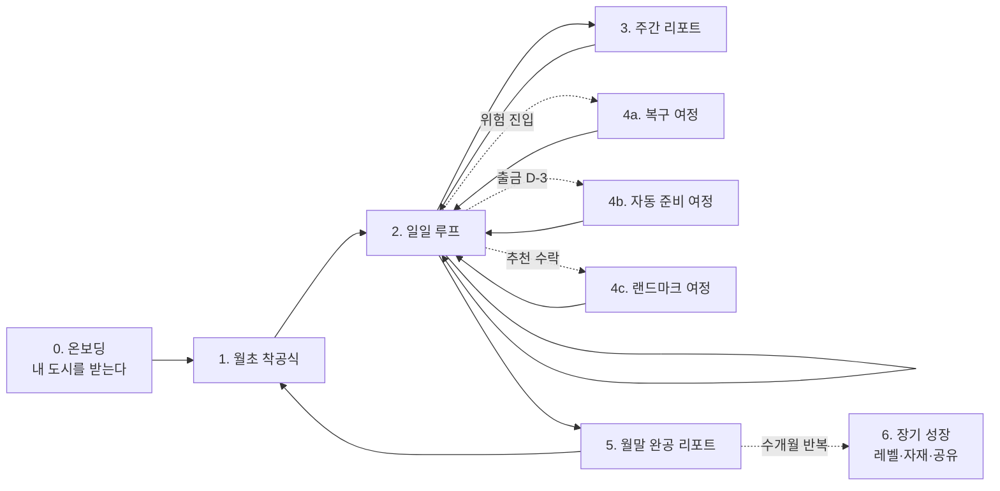

# 셋업 사용자 여정 (v3 포지셔닝 기준)

날짜: 2026년 8월 28일
기준 문서: 「개선된 기획 고도화 v3」

여정의 뼈대는 도시의 시간 축이다. 사용자는 온보딩에서 도시를 받고, 매일 도시를 확인하고, 월말에 도시를 완성한다. 금융 기능(분석·자동 준비·추천)은 각 단계에서 도시를 통해 만난다.

---

## 전체 흐름

---

## 0. 온보딩 — "빈 땅이 아니라 내 도시에서 시작한다" (Day 0, 1회)

| 단계 | 사용자 행동 | 서비스 동작 | 사용자가 느껴야 할 것 |
| --- | --- | --- | --- |
| 가입·연결 | 회원가입, 계좌·카드 연결 동의 | 발주처 내부 API로 거래 내역 수집 | 절차가 짧다 |
| 도시 생성 | 기다린다 (수 초) | 직전 1~3개월 내역을 자동 분류하고 '기존 도시'를 생성 | **첫 화면이 이미 내 도시다.** 식비가 큰 사람은 큰 음식점이, 구독이 많은 사람은 극장가가 보인다 |
| 도시 탐색 | 건물을 탭한다 | 건물 → 카테고리 지출 요약 → 원인 거래 목록 | "이 도시가 내 소비구나" (소유감 + 분석 가치 동시 전달) |
| 설계도 확정 | AI 제안 예산을 확인·수정·확정 | 카테고리별 가상 예산 제안 | 예산이 건물의 설계도라는 프레임 |
| 엔진 연결 | 수입 계좌·결제 계좌 지정, 자동 준비 동의 | 정기 지출 탐지, 출금 일정 캘린더 생성 | "이 건물들은 앱이 대신 지켜준다" |

- 예산을 정하지 않은 카테고리는 회색 '미개발 부지'로 남는다. 강제하지 않는다.
- 온보딩의 성공 기준: 첫 세션에서 사용자가 건물 1개 이상을 탭해 원인 거래까지 내려가 보는 것.

## 1. 월초 착공식 (매월 1일 전후)

1. 푸시: "새 달이 시작됐어요. 이번 달 설계도를 확인하세요."
2. 지난달 결과가 반영된 조정 예산을 확인하고 '착공' 버튼을 누른다.
3. 모든 건물이 공사 상태로 재시작된다. 레벨과 장식은 유지된다.

월초 재시작 심리를 의식적으로 활용한다. 지난달에 실패한 사용자에게도 "이번 달은 새 공사"라는 리셋감을 준다.

## 2. 일일 루프 (매일, 핵심 반복 단위)

1. **진입 계기**: 아침 브리핑 푸시 1건 (기본, 사용자 설정 가능).
2. **어제의 반영**: 어제 소비가 반영된 도시. 계획을 지킨 카테고리는 벽돌 한 층이 올라가는 애니메이션(스킵 가능).
3. **페이스 확인**: 카테고리별 페이스 한 줄 요약. 1~5일차는 '측량 중'으로 판정 유보.
4. **오늘의 일정**: 오늘 출금 예정과 결제 계좌 준비 상태.
5. 이탈 또는 상세 탐색 (건물 탭 → 거래 확인).

목표 체류: 30초~1분. 매일 길게 쓰는 앱이 아니라 **매일 확인하고 싶은 앱**이다. 성과 지표의 주간 방문일수·D30 리텐션이 이 루프에 걸려 있다.

## 3. 주간 리포트 (주 1회)

가장 잘 지은 건물 1개, 점검 필요 건물 1개, 다음 주 출금 총액. 잘한 것을 먼저, 경고는 하나만.

## 4. 월중 분기 여정

### 4a. 위험 진입 → 복구 (계획이 무너지고 있는 사용자)

1. 페이스 > 1.20 진입 시 알림: "남은 N일 동안 하루 X원 이내면 정상 완공 가능." 순수 경고는 금지, 회복 경로를 반드시 함께 제시한다.
2. 남은 기간 페이스 1.0 이하 유지 시 '주의' 복귀, '보수 공사' 연출.
3. 산술적 회복 불가 시: "이 건물은 이번 달 여기까지. 나머지 건물을 지키면 도시 전체는 정상." 한 카테고리의 실패가 앱 이탈로 번지는 것을 차단한다.

이 분기의 성공 기준은 가드레일 지표('위험' 진입 후 7일 내 미접속률)로 검증한다. **초과한 사용자가 앱을 피하지 않는 것**이 이 여정의 존재 이유다.

### 4b. 출금 D-3 → 자동 준비 (고정 지출)

1. 출금 D-3, 잔액 부족 예상 시 건물에 경고등 + 알림.
2. 자동 준비가 수입 계좌에서 결제 계좌로 필요 금액을 이체 → 건물 골조 안정.
3. 출금일에 정상 출금 → 건물 완공.

사용자가 아무것도 하지 않아도 매달 반복되는 이 여정이 자동 준비의 가치를 도시 위에서 계속 보여준다. 3개월 무사고면 시계탑 랜드마크로 기념된다.

### 4c. 추천 수락 → 랜드마크 (비용 절감)

1. AI가 미사용 구독·할부 수수료 등 절감 가능 비용을 탐지해 제안.
2. 사용자가 수락(구독 해지, 할부 완납)하면 도시에 랜드마크가 생긴다: 해지한 구독 자리에 공원, 할부 완납은 다리 완공.
3. '없앤 것'이 '생긴 것'으로 남아, 절감 행동의 심리 보상을 도시가 대신한다.

## 5. 월말 완공 리포트 (매월 말일)

1. 도시 스냅샷 + 숫자 3개: 총지출 / 계획 준수율 / 아낀 돈.
2. 한 달 타임랩스 (공유 가능, 금액 숨김 기본 ON).
3. 지난달 도시와 Before/After.
4. 부실 건물 → 원인 거래 Top 3 → **다음 달 예산 조정 원클릭 반영** → 1번(착공식)으로 순환.

월말 확정 판정은 여기서만 한다. 완공 리포트 열람률과 착공식 완료율이 이 순환의 건강도 지표다.

## 6. 장기 성장 여정 (3개월~)

| 시점 | 이벤트 | 의미 |
| --- | --- | --- |
| 매월 | '정상' 이상 카테고리당 자재 지급 → 도시 꾸미기 | 계획 준수만이 재화 획득 경로 (현금 구매 불가) |
| 3~6개월 | 건물 레벨 승급 (최근 6개월 중 4개월 '정상' 이상, 누적 조건) | 포장마차 → 레스토랑. 한 달 실수가 성장을 끊지 않는다 |
| 3개월+ | 랜드마크 축적 (시계탑, 공원, 다리, 금고 증축) | 내 금융 행동의 이력이 도시 지형이 된다 |
| 수시 | 타임랩스·도시 공유 | 금액 없이 도시만 공유. 바이럴 경로 |

장기 여정의 목표: 도시가 "이번 달 성적표"에서 "내 금융 생활의 누적 기록"으로 바뀌는 것. 이탈하면 도시가 아까워지는 상태가 3개월차의 목표다.

## 엣지 여정

| 상황 | 처리 |
| --- | --- |
| 월중 신규 카테고리 발생 | 해당 월 '측량 중', 익월부터 판정 |
| 이사·여행·경조사 | '특별 공사 기간' 마킹 시 강등 제외 (연 2~3회) |
| 환불·결제 취소 | 소진률 재계산, 상태 자동 갱신 |
| 알림 피로 | '조용한 모드' (주 1회)로 전환. 일일 루프 대신 주간 리포트가 진입 계기가 된다 |

---

## 여정 × 기능 매핑 요약

| 여정 단계 | 만나는 금융 기능 |
| --- | --- |
| 온보딩 | 거래 수집, 자동 분류, AI 예산 제안 |
| 일일 루프 | 지출 반영, 페이스 계산, 출금 일정 |
| 4a 복구 | AI 소비 분석 (회복 경로 계산) |
| 4b 자동 준비 | **결제 계좌 자동 준비** (핵심 실행 기능) |
| 4c 랜드마크 | 비용 절감·상품·정책 추천 |
| 월말 리포트 | 소비 분석 요약, 예산 조정 |

모든 금융 기능이 도시의 특정 순간에 매핑된다. 도시 밖에서 따로 발견해야 하는 기능은 없다.
