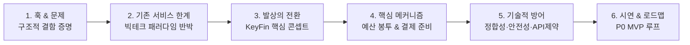

# KeyFin 기획 발표 흐름 설계 (심사위원 설득 프레임워크 v1.0)

> 본 문서는 [기획 발표 흐름 리서치 리포트](file:///C:/Users/SSAFY/Desktop/특화PJT_기획/06/RESEARCH/planning-pitch-flow_2026-09-03/report.md)의 **STRUCT-PITCH 프레임워크**와 [01_KeyFin_기획의도.md](file:///C:/Users/SSAFY/Desktop/특화PJT_기획/06/01_KeyFin_기획의도.md), [02_KeyFin_요구사항명세.md](file:///C:/Users/SSAFY/Desktop/특화PJT_기획/06/02_KeyFin_요구사항명세.md)의 요구사항을 융합하여 설계한 **8분 기획 발표 표준 가이드**입니다.

---

## 1. 기획 발표 전략 및 심사위원 공략 포인트



- **핵심 목표**: 단순한 "아이디어 발표"가 아닌, **"기술적 고민과 안전장치가 완비된 실행 가능한 프로젝트"**임을 증명.
- **심사위원 공략 3대 원칙**:
  1. **사후 기록 vs 사전 통제**: 가계부의 본질적 한계를 짚고 패러다임 전환 설득.
  2. **알림 vs 실행**: 토스·뱅샐 등 빅테크와의 차별점을 '자동 이체 실행력'으로 선명하게 분리.
  3. **엔지니어링 무결성**: LLM 환각 분리(코칭 vs 계산) 및 금융망 API 멱등성 검증 완료 강조.

---

## 2. 슬라이드별 상세 발표 흐름표 (8분 기준)

| 슬라이드 | 시간 | 단계 | 핵심 발표 스크립트 (구체적 발화) | 화면 및 시각 자료 연출 | 심사위원 의구심 선제 방어 | 매핑 요구사항 |
| :---: | :---: | :---: | :--- | :--- | :--- | :--- |
| **#1** | 0:00~0:40 | **Hook & Problem**<br>(상식 충돌) | "월급날 결심하지만 월말이면 잔고가 바닥나는 경험, 다들 있으실 겁니다. 많은 사람들이 이를 '의지 부족'이라 탓합니다. **하지만 계획된 소비가 안 되는 진짜 이유는 의지가 아니라 금융 UI의 구조적 문제입니다.**" | • 텅 빈 통장 잔고와 카드 청구서<br>• 볼드 카피: *"의지의 문제가 아니라 구조의 문제다"* | "흔한 일상 불편을 거창하게 포장한 것 아닌가?" ➔ 구조적 결함으로 프레이밍 전환 | 01 문서 1절 기획 배경 |
| **#2** | 0:40~1:30 | **Gap Analysis**<br>(기존 해법 반박) | "기존 가계부는 돈을 이미 다 쓴 뒤에 적는 '사후 반성문'입니다. 반면 토스나 카카오는 카드값이 나간다고 알림만 줄 뿐, 돈을 옮기는 귀찮은 노동은 여전히 사용자의 몫입니다. **알림을 받고도 까먹으면 연체가 발생합니다.**" | • 토스·뱅샐·카카오 기능 한계 도식화<br>• [알림 수신 ➔ 잔액 확인 ➔ 수동 이체 ➔ 연체 위험]의 실패 경로 빨간선 표시 | "토스 자산관리가 이미 다 해주지 않나?" ➔ '조회·알림'과 '실행'의 본질적 차이 증명 | 01 문서 2절, 4절<br>(경쟁 서비스 차별점) |
| **#3** | 1:30~2:30 | **Core Concept**<br>(발상의 전환) | **"그래서 KeyFin은 발상을 뒤집습니다.**<br>첫째, 돈을 쓴 뒤에 반성하는 것이 아니라, **쓸 수 있는 돈을 7개 '예산 봉투'로 미리 가두고 결제 즉시 차감**합니다.<br>둘째, 나갈 돈은 사람이 챙기지 않고, **시스템이 미리 계산해 승인 한 번으로 결제 계좌를 채워 넣습니다.**" | • KeyFin 브랜드 및 메인 홈(내 방) 화면<br>• 좌: 사후 기록 가계부 vs 우: 사전 통제 KeyFin 비교 다이어그램 | "단순 가계부 앱과의 차별점이 무엇인가?" ➔ 사전 예산 가둠 + 자동 결제 준비 콘셉트 제시 | 01 문서 5절 한 문장 요약<br>02 문서 FR-BGT-01~04<br>FR-PAY-01~03 |
| **#4** | 2:30~4:00 | **Mechanism**<br>(핵심 아키텍처) | "원리는 명확합니다. 금융망 거래가 들어오면 자체 가맹점 세분류 매핑을 통해 7개 봉투에서 1초 만에 즉시 차감됩니다. 또한 캘린더가 월세, 공과금, 카드 대금 일정을 통합하여 결제일 전에 필요한 부족액을 산출하고 사전 이체 팝업을 띄웁니다." | • 7개 봉투 실시간 차감 플로우 차트<br>• 정기 지출 캘린더 및 선이체 시퀀스 다이어그램 | "기술적으로 어떻게 동작하는가?" ➔ 자체 세분류 매핑 원장 + 스케줄러 시각화 | 02 문서 FR-TXN-01~02<br>FR-PAY-01~04<br>NFR-TXN-01 |
| **#5** | 4:00~5:30 | **Technical Defense**<br>(정합성과 안전성) | "금융 서비스이기에 기술적 안전장치에 가장 많은 공을 들였습니다.<br>첫째, **환각 방지**: LLM에게 금액 계산을 절대 맡기지 않습니다. 숫자는 100% 결정론적 규칙 엔진이 계산하고, AI는 오직 고양이 코치의 페르소나 말투와 코칭 멘트만 생성합니다.<br>둘째, **중복 이체 방지**: 금융망 `기관거래고유번호` 기반 멱등성을 실검증하여 네트워크 장애 시에도 중복 출금을 원천 차단했습니다." | • 아키텍처 다이어그램: [규칙 엔진(원장/계산)] vs [LLM Agent(코칭/말투)] 물리적 분리<br>• 멱등성 검증(H1007) 로그 스크린샷 | "AI 환각으로 잘못된 돈이 나가면 어떡하나?", "이체 오류 방지는?" ➔ 철저한 아키텍처 분리와 멱등성으로 완벽 방어 | 01 문서 4절 기술적 차별점<br>02 문서 FR-AI-01~02<br>NFR-BGT-01, NFR-PAY-01 |
| **#6** | 5:30~6:30 | **Gamification**<br>(지속 가능 동기) | "돈 관리는 본질적으로 지루합니다. KeyFin은 홈 화면을 '내 방'으로 만들고, 결제 카테고리에 따라 아바타가 쇼핑백을 들거나 약봉투를 쥐며 반응합니다. 특히 코인은 부자에게 더 많이 주는 것이 아니라, **소득과 무관하게 '자신의 예산을 지켰는가'에만 공평하게 지급**되어 꾸미기 보상으로 이어집니다." | • 내 방 UI 그래픽<br>• 아바타 소비 반응 7종 및 가을 테마 룸 연출<br>• 코인 보상 규칙 (일/주/월) | "사용자가 며칠 쓰다 이탈할 텐데?" ➔ 행동 경제학적 보상 체계(내 방 꾸미기 + 공평한 예산 준수 코인) | 01 문서 3절 ③<br>02 문서 FR-GAM-01~06 |
| **#7** | 6:30~7:20 | **Live Demo Scenario**<br>(실현 가능성 증명) | "저희는 2026년 9월 1일 금융망 API 실검증을 마쳤으며, 핵심 시연 루프(P0 21건)를 완벽히 도출했습니다.<br>**[회원가입 ➔ 과거 소비 기반 예산 봉투 생성 ➔ 카드 결제 감지 ➔ 실시간 차감 & 고양이 코칭 ➔ 정기 지출 선이체 승인 ➔ 코인 획득]**으로 이어지는 단일 엔드투엔드 시연을 준비했습니다." | • P0 핵심 21개 기능 시연 동선 인포그래픽<br>• 금융망 API 검증 완료 내역 (시딩-라이브 원장 분리) | "제작 기간 내에 실제 동작하는 결과물이 나오는가?" ➔ P0 범위 확정 및 API 검증 증명 | 02 문서 3절(제약 대응)<br>02 문서 5절(P0 21건 요약) |
| **#8** | 7:20~8:00 | **Vision & Closing**<br>(수미상관 회수) | "가계부 쓰느라 스트레스받지 마세요. 내 방에 들어와 고양이 코치의 한마디를 보고, 나갈 돈은 KeyFin에게 맡겨두면 됩니다.<br>**단순 기록을 넘어, 소비 습관을 설계하는 생활 금융 서비스 — KeyFin이었습니다.** 감사합니다." | • KeyFin 대표 슬로건 및 팀원 역할 소개<br>• *"기록하는 가계부가 아닌, 습관을 만드는 생활 금융"* | 발표 인상 각인 및 강력한 피칭 마무리 | 01 문서 5절 한 문장 요약 |

---

## 3. 심사위원 핵심 Q&A 방어 매트릭스

| 분야 | 예상 질문 | 핵심 답변 키워드 및 논리 근거 |
| :--- | :--- | :--- |
| **기획/차별성** | *"토스나 뱅크샐러드에서도 카테고리별 예산이나 정기결제 알림을 주는데, 굳이 이 앱을 쓸 이유가 있나요?"* | **"알림과 실행의 차이입니다."** 토스는 결제일 알림을 주지만 돈을 옮기는 건 사용자 몫이라 미납이 생깁니다. KeyFin은 결제일 전 필요 금액을 산출해 **승인 기반 선이체로 결제 계좌를 직접 채워 넣습니다.** 또한 사후 통계가 아닌 결제 직후 실시간 차감으로 다음 소비를 제어합니다. |
| **기술/AI** | *"금융 도메인에서 생성형 AI(LLM)의 환각(Hallucination) 위험을 어떻게 해결했습니까?"* | **"역할의 물리적 분리입니다."** 예산 잔여율, 초과 금액, 이체 필요액 등 모든 수치는 **결정론적 규칙 엔진**이 100% 계산합니다. LLM은 오직 코칭 페르소나(도도냥/온순냥/지방냥)의 말투 생성과 비정형 소비 피드백 문장 구성에만 관여하도록 아키텍처를 분리했습니다 (`FR-AI-01~02`). |
| **기술/금융망** | *"자동 이체 기능에서 중복 출금이나 네트워크 단절 사고는 어떻게 방지하나요?"* | **"기관거래고유번호 기반 멱등성 보장입니다."** 9월 1일 금융망 API 실검증을 통해 중복 요청 거부(H1007)를 확인했습니다. 모든 이체 트랜잭션은 고유 멱등 키로 관리되며, 사전 동의(opt-in) 및 일일 한도 설정(`FR-PAY-04`)을 통해 임의 출금을 원천 차단했습니다. |
| **실현 가능성** | *"금융망 API에서 과거 거래 데이터 생성이 불가능한데 시연과 온보딩 분석은 어떻게 하나요?"* | **"시딩-라이브 분리 원장 구조입니다 (`NFR-TXN-02`)."** 온보딩용 과거 3개월 소비 이력은 자체 원장 DB에 시딩(SEED) 데이터로 적재하여 즉시 AI 예산 제안으로 연결하고, 실제 시연 시 발생하는 거래는 LIVE 태그로 분리 처리하여 API 제약 사항을 완벽히 우회했습니다. |

---

## 4. 발표 시연(Demo) 필수 동선 가이드 (P0 MVP 21건)

```
[Step 1] 사용자 온보딩 & 계좌 연동 (FR-USR-01~03)
   ⬇
[Step 2] 과거 소비 기반 7개 예산 봉투 AI 제안 및 사용자 승인 (FR-BGT-01~02)
   ⬇
[Step 3] 가상 결제 발생 (외식 15,000원) ➔ 봉투 실시간 차감 & 아바타 반응 (FR-TXN-01~02, FR-GAM-02)
   ⬇
[Step 4] 우려 결제 발생 시 AI 고양이 코치 페르소나 알림 (FR-AI-01~02)
   ⬇
[Step 5] 정기 결제 캘린더 통합 확인 및 결제 준비 선이체 팝업 승인 (FR-PAY-01~04)
   ⬇
[Step 6] 예산 준수 미션 완료 ➔ 코인 획득 및 방 가구 배치 (FR-GAM-03, FR-GAM-05)
```
