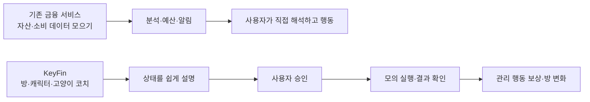

# KeyFin 경쟁 서비스 조사

> 조사일: **2026-09-02**
> 조사 대상: 토스, 뱅크샐러드, 카카오페이, YNAB
> 기준 문서: [KeyFin 기획](./KeyFin_기획.md)

## 1. 먼저 보는 결론

- 자산 통합, 소비 자동 기록, 카테고리 분류, 소비 분석, 고정 지출 알림은 이미 여러 서비스가 제공한다. 토스는 고양이 키우기와 포인트 보상도 제공한다. 따라서 `자산 통합`, `AI`, `캐릭터`, `보상`을 각각 KeyFin만의 기능이라고 쓰면 안 된다.
- KeyFin이 차별화할 수 있는 지점은 **금융 상태를 방과 캐릭터로 쉽게 보여주고 → 고양이 코치가 다음 행동을 설명하고 → 사용자가 승인한 뒤 → 결과를 확인하고 → 관리 행동을 보상하는 한 흐름**이다. 이 조합은 이번에 확인한 공식 페이지에서 확인하지 못했으므로, ‘시장에 없는 유일한 기능’이 아니라 **검증할 차별화 가설**로 표현한다.
- 특히 카카오페이는 자산 분석·예측을 바탕으로 필요한 정보를 먼저 챙기는 ‘금융비서’를 공식 소개하고, 뱅크샐러드도 AI 금융 멘토 콘텐츠를 소개한다. 뱅크샐러드 공식 글에는 ‘출시 준비 중’이라고 적혀 있다. KeyFin은 **AI 자체**보다 계산·설명·승인·실행의 역할을 분리하는 경험을 차별점으로 삼는 편이 안전하다. [카카오페이 금융비서](https://contents.kakaopay.com/contents/2438), [뱅크샐러드 AI 토핑+](https://www.banksalad.com/articles/%ED%86%A0%ED%95%91%ED%94%8C%EB%9F%AC%EC%8A%A4-%EC%86%8C%EA%B0%9C)

## 2. 조사 범위와 읽는 법

| 표시 | 의미 |
|---|---|
| ✅ 확인 | 공식 웹사이트·공식 도움말·공식 콘텐츠에서 기능을 명시함 |
| ◐ 일부 확인 | 관련 요소 일부는 공식 자료에서 확인했지만, KeyFin이 비교하는 전체 기능과는 범위가 다름 |
| △ 준비 중 | 공식 콘텐츠에 준비·출시 예정으로 표시됨. 현재 제공 기능으로 단정하지 않음 |
| ? 확인 불가 | 이번에 확인한 공식 자료에서 명시적 근거를 찾지 못함. 기능이 없다는 뜻은 아님 |

경쟁 서비스의 기능 부재를 단정하지 않았다. 아래 `확인 불가`는 **조사한 공식 자료의 범위에서 확인하지 못한 상태**다.

## 3. 서비스별 실제 확인 내용

### 3.1 토스 — 통합 조회와 금융 일정 안내에 강함

| 영역 | 공식 자료에서 확인한 내용 | KeyFin과의 관계 |
|---|---|---|
| 자산 통합 | 여러 금융기관의 입출금·저축·대출·증권 계좌를 모아 총자산과 보유처를 보여준다. [토스 자산 관리 공식 페이지](https://i18n.toss.im/service/asset-management) | **겹침**: KeyFin의 자산 상태 화면 |
| 소비 기록·분석 | 통장 입출금 내역을 소비 캘린더에 자동 기록하고, 소비 분석 그래프로 소비 패턴을 보여준다. [토스 자산 관리 공식 페이지](https://i18n.toss.im/service/asset-management) | **겹침**: KeyFin의 소비 내역·리포트 |
| 고정 지출·카드 청구 | 관리비·통신비·보험료·OTT 구독료 같은 고정 지출을 모아 보여주고, 카드사별 청구 금액과 날짜를 미리 알려준다. [토스 자산 관리 공식 페이지](https://i18n.toss.im/service/asset-management) | **겹침**: KeyFin의 예정 지출·캘린더 |
| 위험 알림·제안 | 카드값보다 계좌 잔액이 부족할 때 알리고, 보유 통장의 금리를 비교해 높은 금리 계좌를 찾는 기능을 소개한다. [토스 자산 관리 공식 페이지](https://i18n.toss.im/service/asset-management) | **겹침**: KeyFin의 금융 상태 알림·행동 제안 |
| 캐릭터·방·코인 | 토스의 공식 혜택 페이지는 고양이 이름 짓기·옷 입히기·미션과 성장 보상을 소개한다. 다만 금융 상태나 예산 관리 행동과 연결된다는 설명은 해당 자료에서 확인하지 못했다. [토스 혜택 공식 페이지](https://toss.im/service/benefits) | **부분 겹침**: 캐릭터·보상 자체는 차별점이 아님. 금융 상태와의 연결은 KeyFin의 검증 대상 |
| AI 코칭·승인 후 실행 | 확인한 공식 자산 관리 페이지에서 고양이형 AI 코치와 ‘내용 확인 후 사용자 승인 → 실행’의 전체 흐름은 확인하지 못했다. | **? 확인 불가**. KeyFin의 검증 대상 |

**해석:** 토스와의 정면 경쟁을 ‘자산을 더 많이 모은다’로 잡으면 불리하다. KeyFin은 토스가 이미 잘하는 통합 조회를 전제로, 초보 사용자가 상태를 이해하고 다음 행동을 선택하게 하는 경험을 검증해야 한다.

### 3.2 뱅크샐러드 — 자동 가계부·카테고리 학습·비교 분석에 강함

| 영역 | 공식 자료에서 확인한 내용 | KeyFin과의 관계 |
|---|---|---|
| 자산·소비 자동화 | 마이데이터로 은행·카드·보험·주식 등 자산을 조회하고, 소비 내역을 자동 기록·분석한다고 소개한다. [뱅크샐러드 공식 소개](https://go.banksalad.com/introduce01/) | **겹침**: KeyFin의 자산·소비 화면 |
| 카테고리 분류 | 거래처명을 기준으로 카테고리를 자동 분류하며, 같은 거래처명·결제수단·대분류에 대해 사용자가 3~4회 이상 같은 카테고리로 수정하면 학습한다고 안내한다. [뱅크샐러드 고객센터: 가계부 분류](https://help.banksalad.com/2d2116e2-39f6-8055-ab7d-ca69a651b309) | **겹침**: KeyFin의 자동 분류. KeyFin은 신뢰도 낮은 경우 질문하는 방식으로 설계 |
| 예산·소비 리포트 | 공식 업데이트에서 월간 소비 리포트, 소비 항목 점검, 유사 순자산·연소득 사용자와의 비교를 안내한다. [뱅크샐러드 고객센터: 월간 소비 리포트](https://help.banksalad.com/update_2503) | **겹침**: KeyFin의 예산·월간 리포트 |
| 금융상품 추천 | 실제 소비 데이터를 상품 조건과 비교해 카드 혜택을 계산하고, 추천 근거를 상세 화면에서 확인할 수 있다고 설명한다. [뱅크샐러드 고객센터: 카드 추천 방식](https://help.banksalad.com/129) | **부분 겹침**: 데이터 근거를 보여주는 원칙. KeyFin은 금융상품 판매보다 소비 관리 행동에 집중 |
| AI 금융 멘토 | ‘AI 토핑+’가 소비 분석·예산 제안·소비 성향 설명을 할 수 있도록 준비 중이라고 소개한다. 공식 글의 표현이 ‘출시 준비 중’이므로 현재 제공 기능으로 단정하지 않는다. [뱅크샐러드 공식 콘텐츠: AI 토핑+](https://www.banksalad.com/articles/%ED%86%A0%ED%95%91%ED%94%8C%EB%9F%AC%EC%8A%A4-%EC%86%8C%EA%B0%9C) | **△ 준비 중**: KeyFin은 AI 자체가 아니라 계산·설명·승인 경계를 차별화해야 함 |
| 캐릭터 방·관리 행동 보상 | 토스는 고양이 꾸미기·미션·성장 보상을 공식적으로 소개하지만, 확인한 자료에서 예산 확인·소비 분류 같은 금융 관리 행동에 보상을 연결하는 흐름은 확인하지 못했다. [토스 혜택 공식 페이지](https://toss.im/service/benefits) | **부분 겹침**: 캐릭터·보상은 겹침. 금융 관리 행동과의 연결은 KeyFin의 검증 대상 |
| 승인 후 금융 실행 | 확인한 공식 자료에서 제안 내용을 사용자가 승인한 뒤 금융 행동을 실행하는 전체 흐름은 확인하지 못했다. | **? 확인 불가**. KeyFin의 안전 설계 가설 |

**해석:** 뱅크샐러드 때문에 ‘자동 분류’, ‘예산’, ‘AI가 내 소비를 분석한다’는 문구는 차별성이 아니다. KeyFin은 자동 분류를 그대로 확정하지 않고, **확신이 낮을 때만 묻고 확정된 내역만 예산에 반영**하는 사용자 경험을 분명히 해야 한다.

### 3.3 카카오페이 — 통합 내역과 일정·공유 관리에 강함

| 영역 | 공식 자료에서 확인한 내용 | KeyFin과의 관계 |
|---|---|---|
| 자산 조회 | 자산관리에서 여러 자산을 조회하고, 금융 일정·자산 분석·매달 나가는 고정 지출을 관리한다고 안내한다. [카카오페이 자산관리 공식 페이지](https://www.kakaopay.com/services/management/pfm) | **겹침**: KeyFin의 자산·예정 지출 화면 |
| 통합 거래 내역 | 마이데이터로 카드·은행·포인트 정보를 연결하면 결제수단별·과거 소비 내역을 한 곳에서 볼 수 있다고 설명한다. [카카오페이 공식 콘텐츠: 통합 내역과 자산분석](https://contents.kakaopay.com/contents/2394) | **겹침**: KeyFin의 최근 거래·소비 분석 |
| 자동 카테고리·검색 | 식비·온라인쇼핑·병원비 등으로 자동 분류하고, 사용자가 카테고리를 설정할 수 있으며, 결제처·상품명 검색도 가능하다고 안내한다. [카카오페이 공식 콘텐츠: 통합 내역과 자산분석](https://contents.kakaopay.com/contents/2394) | **겹침**: KeyFin의 분류·수정 UX |
| 함께 관리 | 초대받은 상대와 공유할 자산만 선택하고, 내역에 메시지를 남기는 ‘함께하는 자산관리’를 소개한다. [카카오페이 공식 콘텐츠: 함께하는 자산관리](https://contents.kakaopay.com/contents/2439) | **부분 겹침**: KeyFin은 개인 방 중심이며, 협업보다 개인 행동 루프에 집중 |
| AI 금융비서 | 2024년 5월 공식 콘텐츠는 자산을 분석·예측해 필요한 정보를 먼저 챙기는 대화형 챗봇을 소개하고, 적금 만기·월급·청약·OTT 분석 예시를 제시한다. 해당 콘텐츠가 현재도 제공되는지는 별도 확인이 필요하다. [카카오페이 공식 콘텐츠: 금융비서](https://contents.kakaopay.com/contents/2438) | **겹침**: AI 금융 안내·예측. KeyFin의 차이는 규칙 기반 계산·사용자 승인 흐름 |
| 예산 설정 | 확인한 공식 자료에서 카테고리별 월 예산 설정 기능은 확인하지 못했다. | **? 확인 불가** |
| 캐릭터 방·코인·승인 후 실행 | 확인한 공식 자료에서 금융 상태를 캐릭터·방·코인으로 표현하거나, 제안 후 사용자 승인 뒤 실행하는 흐름은 확인하지 못했다. | **? 확인 불가**. KeyFin의 검증 대상 |

**해석:** 카카오페이와 비교할 때 ‘내역을 한 화면에 모아준다’는 표현은 약하다. KeyFin은 통합 내역을 보여주는 데서 멈추지 않고, **오늘 확인할 한 가지 행동을 캐릭터가 설명하고 보류·거절·승인을 기록**하는 흐름으로 구분해야 한다.

### 3.4 YNAB — 예산 계획과 목표 달성에 특화된 글로벌 서비스

| 영역 | 공식 자료에서 확인한 내용 | KeyFin과의 관계 |
|---|---|---|
| 예산 철학 | 현재 가진 돈을 카테고리에 배정하고, 지출 전에 계획을 확인하며 필요하면 카테고리 사이에서 돈을 이동하는 ‘YNAB Method’를 설명한다. [YNAB 공식: The YNAB Method](https://www.ynab.com/the-four-rules/) | **겹침**: KeyFin의 예산 계획. KeyFin은 숫자와 용어를 캐릭터로 쉽게 전달 |
| 금융 데이터 연결 | 은행 계좌를 연결해 거래를 자동으로 가져올 수 있다고 안내한다. [YNAB 공식 기능](https://www.ynab.com/features) | **겹침**: KeyFin의 데이터 연동 구상 |
| 목표 추적 | 목표 금액을 정하면 주·월·년 또는 사용자 지정 날짜에 맞춰 필요한 저축액을 계산하고, 색상 진행률로 보여주며 목표를 한 달 미룰 수도 있다고 설명한다. [YNAB 공식: Goal Tracking](https://www.ynab.com/features/goal-tracking) | **부분 겹침**: KeyFin의 예산·보상 진행 표시 |
| 리포트·부채 | 소비·순자산 리포트와 대출 상환 계산기를 제공한다고 소개한다. [YNAB 공식 기능](https://www.ynab.com/features) | **부분 겹침**: KeyFin의 월간 리포트. 투자·부채 계산은 MVP 밖 |
| 공유 | 파트너·가족 등 최대 6명이 하나의 구독을 공유하는 기능을 소개한다. [YNAB 공식 기능](https://www.ynab.com/features) | **부분 겹침**: KeyFin의 공유 기능은 현재 핵심 범위가 아님 |
| 한국 금융 연동 | 확인한 공식 기능 페이지에서 한국 금융기관별 지원 범위는 확인하지 못했다. | **? 확인 불가**. 구현 전 별도 기술 검증 필요 |
| 캐릭터 방·AI 코치·코인 | 확인한 공식 기능·방법론 페이지에서 방·아바타·고양이 AI 코치·관리 행동 코인 보상은 확인하지 못했다. | **? 확인 불가**. KeyFin의 경험적 차별화 후보 |

**해석:** YNAB는 ‘예산을 세우고 지출 전에 확인한다’는 행동 원칙을 강하게 갖고 있다. KeyFin은 이 원칙을 버리기보다, 금융 초보자도 이해할 수 있도록 **방·캐릭터·짧은 선택지**로 번역하는 방향이 적절하다.

## 4. 기능 겹침과 차별화 한눈에 보기

| 비교 항목 | 토스 | 뱅크샐러드 | 카카오페이 | YNAB | KeyFin 방향 |
|---|---:|---:|---:|---:|---|
| 여러 자산 한곳에서 보기 | ✅ [공식](https://i18n.toss.im/service/asset-management) | ✅ [공식](https://go.banksalad.com/introduce01/) | ✅ [공식](https://www.kakaopay.com/services/management/pfm) | ✅ [공식](https://www.ynab.com/features) | 차별점으로 주장하지 않음 |
| 소비 자동 기록·분석 | ✅ [공식](https://i18n.toss.im/service/asset-management) | ✅ [공식](https://go.banksalad.com/introduce01/) | ✅ [공식](https://contents.kakaopay.com/contents/2394) | ✅ [공식](https://www.ynab.com/features) | 차별점으로 주장하지 않음 |
| 카테고리·예산 관리 | △ [소비 분석](https://i18n.toss.im/service/asset-management) | ✅ [분류·예산](https://help.banksalad.com/2d2116e2-39f6-8055-ab7d-ca69a651b309) | ✅ [분류](https://contents.kakaopay.com/contents/2394) | ✅ [방법론](https://www.ynab.com/the-four-rules/) | 자동 확정 대신 신뢰도 기반 확인 |
| 예정 지출·고정비 알림 | ✅ [공식](https://i18n.toss.im/service/asset-management) | ✅ [공식 콘텐츠](https://www.banksalad.com/articles/%EA%B0%80%EA%B3%84%EB%B6%80-%EC%97%91%EC%85%80-%EC%96%B4%ED%94%8C-%EC%B6%94%EC%B2%9C-%EC%96%91%EC%8B%9D) | ✅ [공식](https://www.kakaopay.com/services/management/pfm) | ? [기능 범위](https://www.ynab.com/features) | ‘다음 행동’까지 연결 |
| AI 금융 코칭 | ? [확인 불가](https://i18n.toss.im/service/asset-management) | △ [준비 중](https://www.banksalad.com/articles/%ED%86%A0%ED%95%91%ED%94%8C%EB%9F%AC%EC%8A%A4-%EC%86%8C%EA%B0%9C) | ✅ [금융비서 소개](https://contents.kakaopay.com/contents/2438) | ? [확인 불가](https://www.ynab.com/features) | AI 자체가 아니라 계산·설명·승인 경계로 차별화 |
| 방·아바타 중심 금융 UX | ◐ [고양이·미션](https://toss.im/service/benefits) | ? [확인 불가](https://go.banksalad.com/introduce01/) | ? [확인 불가](https://www.kakaopay.com/services/management/pfm) | ? [확인 불가](https://www.ynab.com/features) | 금융 상태를 방·아바타에 연결하는 경험 후보 |
| 사용자가 승인한 금융 행동 | ? [확인 불가](https://i18n.toss.im/service/asset-management) | ? [확인 불가](https://www.banksalad.com/) | ? [확인 불가](https://www.kakaopay.com/services/management/pfm) | ? [확인 불가](https://www.ynab.com/features) | MVP는 모의 실행, 실제 실행은 별도 검증 |
| 금융 관리 행동에 대한 코인·꾸미기 | ? [금융 관리 연계 확인 불가](https://toss.im/service/benefits) | ? [확인 불가](https://go.banksalad.com/introduce01/) | ? [확인 불가](https://www.kakaopay.com/services/management/pfm) | ? [확인 불가](https://www.ynab.com/features) | 결제가 아니라 확인·분류·점검에 보상 |

## 5. 조사에 근거한 KeyFin 차별성

### 5.1 차별성이 아닌 것

| 기존에 이미 확인된 기능 | KeyFin 문서에서 피해야 할 표현 |
|---|---|
| 자산을 한곳에 모아 보기 | “흩어진 자산을 처음으로 통합한다” |
| 소비 자동 기록·분석 | “자동으로 소비를 분석하는 유일한 서비스” |
| 카테고리 분류·예산·고정비 | “예산과 카테고리를 제공하는 최초의 서비스” |
| AI로 소비를 설명하는 방향 | “AI 금융 코칭 자체가 유일하다” |

### 5.2 현재 근거로 세울 수 있는 차별화 가설

| 차별화 가설 | 조사 근거 | KeyFin에서 보여줄 방식 | 주장 수준 |
|---|---|---|---|
| 금융 상태를 ‘방과 캐릭터’로 이해시킨다 | 조사한 4개 서비스 공식 자료에서 방·아바타를 금융 상태의 기본 화면으로 연결한 설명은 확인하지 못함. [KeyFin 기준 문서](./KeyFin_기획.md) | 방 보드=예산, 캘린더=예정 지출, 캐릭터=소비 상태 | **검증할 경험적 차별화** |
| 알림에서 끝내지 않고 승인 선택까지 이어진다 | 토스는 잔액 부족 알림·금리 비교를, YNAB는 지출 전 계획 확인을 명시하지만, 조사 범위에서 ‘제안 내용 확인 → 사용자 승인 → 실행 결과’ 전체 흐름은 확인하지 못함. [토스](https://i18n.toss.im/service/asset-management), [YNAB](https://www.ynab.com/the-four-rules/) | 대상·금액·시점·근거를 보여주고 `승인 / 나중에 / 거절` 선택 제공 | **검증할 행동 차별화** |
| 관리 행동에만 보상을 연결한다 | 토스는 고양이 꾸미기·미션·성장 보상과 포인트 기능을 공식 소개하지만, 확인한 자료에서 예산 확인·소비 분류 같은 금융 관리 행동과 연결된다는 설명은 찾지 못함. [토스 혜택](https://toss.im/service/benefits), [KeyFin 기준 문서](./KeyFin_기획.md) | 분류 확정·예산 점검·리포트 확인으로 코인 지급. 결제액 자체에는 보상하지 않음 | **검증할 동기 차별화** |
| AI의 역할을 제한해 신뢰를 만든다 | 카카오페이는 자산 분석·예측형 금융비서를, 뱅크샐러드는 소비 분석·예산 제안형 AI 토핑+를 공식 소개한다. KeyFin은 규칙 엔진과 AI 코치의 역할을 분리하는 구조를 기획함. [카카오페이 금융비서](https://contents.kakaopay.com/contents/2438), [뱅크샐러드 AI 토핑+](https://www.banksalad.com/articles/%ED%86%A0%ED%95%91%ED%94%8C%EB%9F%AC%EC%8A%A4-%EC%86%8C%EA%B0%9C), [KeyFin 기준 문서](./KeyFin_기획.md) | 금액 계산은 규칙 엔진, AI는 쉬운 설명과 선택지 제시, 실행은 사용자 승인 뒤 | **안전 설계 차별화** |

### 5.3 기획 문서에 넣을 차별성 문장

> **KeyFin은 자산을 모아 보여주는 데서 끝나지 않는다. 금융 상태를 방과 캐릭터로 쉽게 보여주고, 고양이 코치가 근거와 다음 행동을 설명한 뒤, 사용자가 승인한 관리 행동을 모의 실행하고 그 결과를 다시 보여주는 캐릭터형 금융 비서다.**

단, 실제 금융기관 송금·자동이체를 제공한다는 뜻은 아니다. MVP에서는 **승인 후 모의 실행**으로 검증하고, 실제 연동은 별도 기술·규제 검토 뒤 결정한다.

## 6. 경쟁 조사를 반영한 MVP 우선순위

| 우선순위 | 넣을 것 | 이유 |
|---:|---|---|
| 1 | 방 홈 + 예산 보드 + 예정 지출 카드 | 통합 조회 경쟁과 다른 첫 화면 경험을 검증 |
| 2 | 규칙 기반 잔액·예산 계산 | 금액을 AI가 임의로 만들지 않기 위한 신뢰 기반 |
| 3 | 소비 분류 신뢰도와 사용자 확인 | 자동 분류는 경쟁 서비스에도 있으므로 KeyFin의 사용성 차이를 검증 |
| 4 | 고양이 코치의 근거·선택지 설명 | AI ‘있음’이 아니라 다음 행동까지 이어지는지 측정 |
| 5 | 승인·보류·거절 + 모의 실행 | 실제 자금 이동 없이 승인형 흐름을 검증 |
| 6 | 관리 행동 코인·방 꾸미기 1종 | 캐릭터 보상이 행동 지속에 도움이 되는지 검증 |

## 7. 확인이 더 필요한 항목

| 항목 | 현재 상태 | 다음 확인 |
|---|---|---|
| 각 경쟁 서비스의 실제 앱 최신 화면·지역별 제공 범위 | 공식 웹 자료만으로는 일부 확인 불가 | 서비스 가입·앱 화면 또는 공식 고객센터에서 재확인 |
| 한국 금융기관 연동 범위와 비용 | YNAB 공식 기능 페이지에서 한국별 범위 확인 불가 | 연동 사업자·금융기관별 기술 검토 |
| 실제 송금·자동이체를 KeyFin에서 실행할 수 있는지 | 현재 KeyFin MVP는 모의 실행 | 법적·보안·인증 요건 검토 후 별도 결정 |
| 방·아바타·코인 보상의 효과 | 시장 차별화 후보일 뿐 효과 근거 없음 | 사용자 테스트에서 재방문율·행동 완료율 비교 |
| AI 토핑+의 현재 출시 상태 | 공식 글은 ‘출시 준비 중’이라고 명시 | 최신 앱·공식 공지에서 현재 상태 재확인 |

## 8. 공식 출처 목록

모든 외부 근거는 2026-09-02에 확인한 각 서비스의 공식 사이트·공식 고객센터·공식 콘텐츠다.

### 토스

- [토스 자산 관리](https://i18n.toss.im/service/asset-management)
- [토스 혜택 — 고양이 키우기·미션·포인트](https://toss.im/service/benefits)

### 뱅크샐러드

- [뱅크샐러드 공식 소개](https://go.banksalad.com/introduce01/)
- [가계부 분류와 자동 학습 — 뱅크샐러드 고객센터](https://help.banksalad.com/2d2116e2-39f6-8055-ab7d-ca69a651b309)
- [월간 소비 리포트 — 뱅크샐러드 고객센터](https://help.banksalad.com/update_2503)
- [카드 추천 방식 — 뱅크샐러드 고객센터](https://help.banksalad.com/129)
- [AI 토핑+ 소개 — 뱅크샐러드 공식 콘텐츠](https://www.banksalad.com/articles/%ED%86%A0%ED%95%91%ED%94%8C%EB%9F%AC%EC%8A%A4-%EC%86%8C%EA%B0%9C)

### 카카오페이

- [카카오페이 자산관리](https://www.kakaopay.com/services/management/pfm)
- [통합 내역과 자산분석 — 카카오페이 공식 콘텐츠](https://contents.kakaopay.com/contents/2394)
- [금융비서 — 카카오페이 공식 콘텐츠](https://contents.kakaopay.com/contents/2438)
- [함께하는 자산관리 — 카카오페이 공식 콘텐츠](https://contents.kakaopay.com/contents/2439)

### YNAB

- [YNAB 기능](https://www.ynab.com/features)
- [The YNAB Method](https://www.ynab.com/the-four-rules/)
- [Goal Tracking](https://www.ynab.com/features/goal-tracking)
