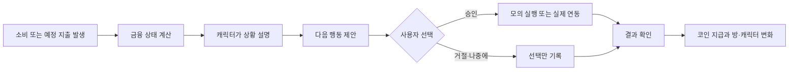
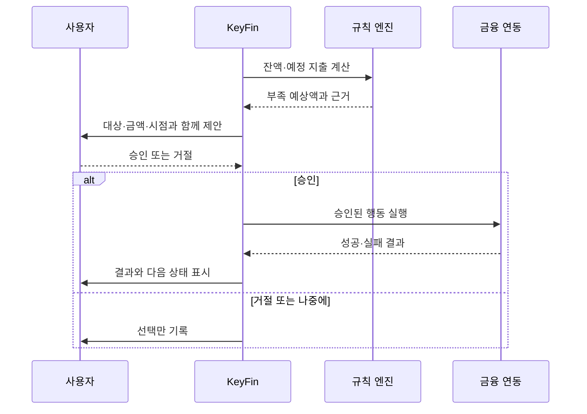

# KeyFin 기획

> **한 줄 설명**  내 소비를 알아보고, 필요한 금융 행동을 쉽게 설명한 뒤, 허락받은 일만 처리하는 캐릭터형 AI 금융 비서입니다.

## 1. 한눈에 보기

| 질문 | 답 |
|---|---|
| 누구를 위한 서비스인가? | 예산을 관리하고 싶지만 숫자와 금융 용어를 매번 해석하기 부담스러운 사람 |
| 어떤 문제를 해결하는가? | 정보는 있어도 앱을 다시 열지 않고, 다음에 무엇을 해야 할지 모르는 문제 |
| 어떻게 해결하는가? | 금융 상태를 방과 캐릭터로 보여주고, 고양이 AI 코치가 다음 행동을 제안 |
| 무엇이 다른가? | 기록과 분석에서 끝나지 않고, 사용자의 승인 뒤 필요한 행동까지 연결 |
| MVP에서 어디까지 하는가? | 데모 금융 데이터와 모의 실행으로 한 가지 관리 흐름을 끝까지 검증 |

## 2. 문제 정의

### 문제 가설

금융 앱에는 잔액, 소비 내역, 예산, 자동이체 일정이 있습니다. 하지만 사용자가 직접 숫자를 읽고, 현재 상황을 해석하고, 다음 행동까지 결정해야 합니다.

그래서 다음 문제가 생깁니다.

| 사용자가 겪는 일 | 왜 불편한가 |
|---|---|
| 현재 쓸 수 있는 금액을 바로 알기 어렵다 | 잔액과 곧 빠져나갈 돈을 따로 확인해야 함 |
| 소비 내역을 봐도 다음 행동이 떠오르지 않는다 | 기록은 남지만 관리 행동으로 이어지지 않음 |
| 알림을 받아도 직접 처리해야 한다 | 은행 앱을 다시 열어 돈을 옮기거나 분류해야 함 |
| 며칠 지나면 앱을 열지 않는다 | 숫자를 확인하는 일만 반복되어 계속 사용할 이유가 약함 |

## 3. 솔루션

KeyFin은 **방을 홈 화면으로 사용**합니다. 방 안의 보드와 캘린더는 예산과 일정을 보여주고, 캐릭터는 소비 상태에 따라 반응합니다. 고양이 AI 코치는 어려운 숫자를 쉬운 말로 설명하고 다음 행동을 제안합니다.

### 역할을 나누는 원칙

| 역할 | 담당 |
|---|---|
| 규칙 엔진 | 잔액, 예산 소진률, 예정 지출, 부족 금액 계산 |
| AI 코치 | 계산 결과를 설명하고 선택지를 제안 |
| 사용자 | 승인, 거절, 보류 선택 |
| 금융 연동 | 승인된 행동만 실행하고 결과 반환 |

AI가 금액을 임의로 계산하지 않도록 **계산과 설명을 분리**합니다. 실제 돈이 움직이는 일은 사용자가 승인한 뒤에만 실행합니다.

## 4. 핵심 기능

| 기능 | 사용자가 보는 것 | 핵심 가치 |
|---|---|---|
| 방이 곧 홈 | 방, 캐릭터, 예산 보드, 일정 캘린더 | 앱을 열었을 때 오늘 확인할 내용을 한눈에 파악 |
| 자산 상태 | 총자산, 계좌·카드·대출, 정기결제, 최근 거래 | 현재 상태와 곧 빠져나갈 돈을 함께 확인 |
| 예산 관리 | 월 예산, 카테고리별 잔액, 소진률 | 지금 얼마나 써도 되는지 바로 이해 |
| 소비 분류 | 자동 분류 결과와 사용자 수정 | 잘못 분류된 소비를 직접 고치고 예산에 반영 |
| 캐릭터 반응 | 카페, 식사, 쇼핑 등 일부 소비에 따른 짧은 행동 | 숫자 대신 소비 상황을 기억하기 쉽게 전달 |
| AI 금융 코칭 | 소비 변화, 예산 소진 예상, 필요한 행동 | 금융 용어를 쉬운 말로 바꾸고 선택지를 제시 |
| 자동이체 준비 | 대상, 금액, 예정일, 제안 근거, 승인 버튼 | 놓치기 쉬운 금융 업무를 실행 단계까지 연결 |
| 보상과 꾸미기 | 관리 행동으로 얻은 코인, 방·캐릭터 아이템 | 잘 관리한 기록을 다음 방문 동기로 연결 |

## 5. 핵심 유저 플로우

| 단계 | 사용자 행동 | 서비스 동작 | 완료 조건 |
|---|---|---|---|
| 1. 시작 | 약관에 동의하고 연결할 자산을 고름 | 연결 결과와 첫 금융 상태를 보여줌 | 사용자가 데이터 범위와 예산을 확인 |
| 2. 오늘 확인 | 홈에서 방과 캐릭터를 봄 | 오늘 확인할 금융 상태 한 가지를 알려줌 | 사용자가 현재 상태를 이해 |
| 3. 소비 반영 | 최근 결제 내역을 확인 | 분류하고 예산을 다시 계산 | 확정 또는 미확정 상태가 기록 |
| 4. 코칭 | 제안의 근거와 선택지를 봄 | AI가 쉬운 말로 설명 | 승인·거절·보류 중 하나를 선택 |
| 5. 실행 | 승인 내용을 다시 확인 | 승인된 행동만 모의 실행하거나 연동 실행 | 성공·실패·미실행을 구분 |
| 6. 보상 | 받은 코인을 사용 | 방이나 캐릭터가 변함 | 지급 근거와 변화가 기록 |
| 7. 회고 | 주간·월간 변화를 봄 | 소비, 예산, 행동 결과를 묶어 보여줌 | 다음 점검 행동이 정해짐 |

## 6. 대표 사용 장면

### 자동이체가 예정된 경우

### 소비가 분류되는 경우

1. 결제 내역이 들어옵니다.
2. 분류 신뢰도가 높으면 결과를 보여주고 수정할 수 있게 합니다.
3. 신뢰도가 낮으면 캐릭터가 추측하지 않고 사용자에게 묻습니다.
4. 확정된 카테고리만 예산에 반영합니다.
5. 답하지 않은 내역은 나중에 한 번에 정리할 수 있습니다.

## 7. 경쟁 서비스와 차별성

아래 비교는 서비스 유형을 기준으로 한 1차 가설입니다. 실제 경쟁 서비스명과 세부 기능은 별도 조사가 필요합니다.

| 비교 대상 | 일반적인 강점 | KeyFin의 차이 |
|---|---|---|
| 일반 가계부 | 기록과 통계 | 캐릭터가 상태를 설명하고 다음 행동까지 제안 |
| AI 금융 알림 | 소비 분석과 알림 | 알림에서 멈추지 않고 승인 뒤 실행 단계로 연결 |
| 펫·꾸미기 앱 | 반복 방문과 성장 재미 | 캐릭터 변화가 실제 금융 상태와 관리 행동에 연결 |
| 자동화 금융 서비스 | 반복 업무 자동 처리 | 사용자가 내용을 확인하고 승인해야 실행 |

### 차별성 한 문장

**KeyFin은 금융 데이터를 귀여운 화면으로 꾸미는 앱이 아니라, 금융 상태를 이해하고 행동하도록 돕는 승인형 AI 비서입니다.**

## 8. MVP 범위

### 포함

- 방과 캐릭터가 있는 홈
- 현재 예산, 카테고리별 상태, 예정 지출 카드
- 데모 소비 내역 반영과 규칙 기반 계산
- 명확한 소비 일부의 캐릭터 반응
- 근거가 붙은 AI 설명
- 자동이체 준비 행동 한 건의 승인·거절·보류
- 모의 실행 결과
- 코인 지급과 방 또는 캐릭터 꾸미기 한 종류

### 제외

- 실제 금융기관 계좌에서 자금 이동
- 투자 종목 추천과 자동 매매
- 모든 상호명을 캐릭터 행동으로 바꾸는 범용 분류
- 여러 캐릭터, 소셜 랭킹, 복잡한 세계관
- 현금 결제형 재화 상점
- 장기 자산 배분과 정교한 금융 예측

## 9. 기대효과와 검증 지표

| 기대효과 | 확인할 지표 |
|---|---|
| 현재 금융 상태를 쉽게 이해 | 상태 확인 뒤 이해도, 재설명 요청률 |
| 소비 확인이 관리 행동으로 연결 | 소비 분류 확정률, 제안 검토율 |
| 놓치기 쉬운 일정을 미리 확인 | 예정 지출 카드 확인률, 준비 행동 완료율 |
| 다시 방문할 이유를 제공 | 최근 소비 반영 뒤 재방문율 |
| AI와 실제 실행을 구분 | 실행 결과 오인율, 승인 없는 실행 건수 |

정량 목표값은 사용자 조사와 MVP 기준값을 확인한 뒤 정합니다. **승인 없는 실행은 0건**이어야 합니다.

## 10. 꼭 지킬 안전 원칙

| 원칙 | 적용 |
|---|---|
| 모르면 단정하지 않기 | 데이터가 부족한 소비는 미확정으로 표시 |
| 계산과 설명 분리 | 금액은 규칙으로 계산하고 AI는 설명만 담당 |
| 실행 전에 묻기 | 대상·금액·시점을 보여주고 승인받기 |
| 실제와 모의 구분 | 미연동 기능은 `설계안` 또는 `모의 실행`으로 표시 |
| 과소비를 보상하지 않기 | 결제 금액·거래 횟수가 아니라 점검·관리 행동에 보상 |

## 11. 다음에 정할 것

- 핵심 사용자의 연령과 생활 조건
- 실제 금융 데이터와 기관 연동 범위
- 소비 분류 신뢰도 기준과 수정 뒤 재계산 규칙
- 코인 지급량, 아이템 가격, 중복 지급 방지 규칙
- 캐릭터 모션과 말투의 구체 기준
- 개인정보 보관·삭제 정책
- 실제 송금 또는 자동이체 실행 여부
- MVP 성공 기준과 목표 수치

## 12. 참고 자료

- 최신 기획안: `05/캐릭터_AI_금융비서_기획.md`
- 발표 서사: `05/기획_발표_서사.md`
- [KeyFin Figma](https://www.figma.com/design/xa7rWgfvEwCLKPlvV6eFQf/KeyFin?node-id=0-1&p=f&t=VBCj2kms7n4UuixG-0)
- [Notion 기획서](https://app.notion.com/p/3cdf938dd4cd8032a946f2c7b1ea6ca5?source=copy_link)
- [Notion AI 에이전트 구체화](https://app.notion.com/p/AI-3cdf938dd4cd8075b65bcef05ac4c367?source=copy_link)
- [Notion 오늘 회의 요약본](https://app.notion.com/p/3cdf938dd4cd80f9bf06db00dfc24870?source=copy_link)
