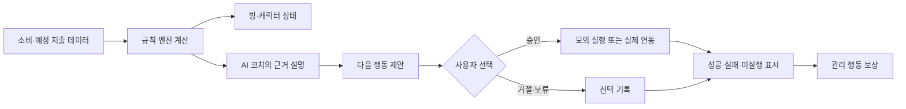
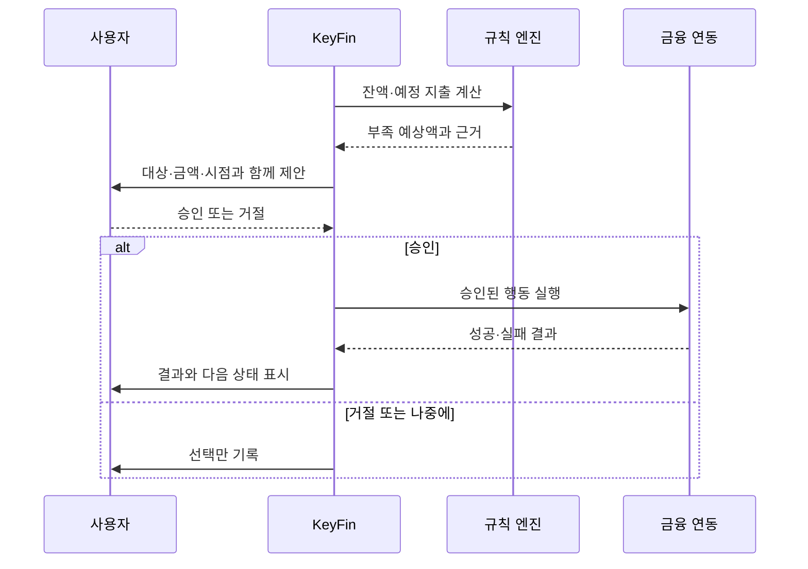

# KeyFin 발표 설계

발표 길이 가정: 7분(420초)
기준 문서: [KeyFin 기획](KeyFin_기획.md)
서사 참고: [신비한 건축사전 영상 패턴 분석](RESEARCH/mysterious-architecture-channel_2026-09-02/report.md)

## 발표 목표

KeyFin을 기능 목록으로 나열하지 않고, 한 사용자가 **현재 금융 상태를 이해하고, 다음 행동을 승인하고, 결과를 확인하는 짧은 루프**로 보여준다.

영상 분석에서 가져온 문법은 다음과 같다.

> 익숙한 장면 → 지금 방식의 모순 → 당연한 해법의 한계 → 발상 전환 → 작동 원리 → 2차 문제와 보정 → 첫 장면 회수

발표에서는 이 긴장 구조를 사용하되, 실제 금융 연동·투자·자동 실행을 구현한 것처럼 말하지 않는다. 와이어프레임의 금액·날짜는 샘플 값이고, MVP 실행 결과는 `모의 실행`이다.

## 전체 흐름 요약

| 장면 | 시간 | 이야기 기능 | 핵심 화면 |
|---:|---:|---|---|
| 1 | 0:00–0:25 | 익숙한 문제 훅 | 홈·예산 카드 |
| 2 | 0:25–0:50 | 숫자와 행동의 간극 | 자산·예산 화면 |
| 3 | 0:50–1:20 | 문제 규모와 모순 | 자산·거래·일정 대비 |
| 4 | 1:20–1:50 | 그래프·알림만으로는 부족한 이유 | 월간 리포트 |
| 5 | 1:50–2:20 | 문제 재정의와 핵심 반전 | 방 홈 화면 |
| 6 | 2:20–2:55 | 제품 공개 | 홈·캐릭터 |
| 7 | 2:55–3:30 | 작동 원리 | 규칙·AI·사용자 흐름 |
| 8 | 3:30–4:00 | 대표 장면: 자동이체 준비 | 승인 기반 시퀀스 |
| 9 | 4:00–4:30 | 2차 문제: 소비 분류 불확실성 | 분류·수정 흐름 |
| 10 | 4:30–5:00 | 안전장치와 신뢰 | 승인·실행 결과 |
| 11 | 5:00–5:25 | 보상과 재방문 | 코인·방 꾸미기 |
| 12 | 5:25–5:55 | 경쟁 대비 차별성 | 비교표·루프 |
| 13 | 5:55–6:20 | MVP 범위 고정 | 포함·제외 목록 |
| 14 | 6:20–6:45 | 검증 지표 | 지표 표 |
| 15 | 6:45–7:00 | 첫 장면 회수와 요청 | 홈 화면 |

## 장면별 화면·나레이션 설계

| # | 시간 | 장면·연출 | 화면에 남길 문장 | 나레이션 |
|---:|---|---|---|---|
| 1 | 0:00–0:25 | [홈 와이어프레임](assets/wireframe-home.png)을 크게 보여준다. 예산 카드만 색으로 강조하고 나머지는 어둡게 둔다. | **잔액은 보이는데, 오늘 쓸 수 있는 돈은 바로 보이지 않습니다.** | “잔액은 확인했습니다. 그런데 오늘 써도 되는 돈과 곧 빠져나갈 돈은 바로 보이지 않습니다. 그래서 금융 앱을 열고도 다음에 무엇을 해야 할지 다시 계산해야 합니다.” |
| 2 | 0:25–0:50 | [자산 화면](assets/wireframe-assets.png)과 [예산 화면](assets/wireframe-budget.png)을 좌우로 배치한다. 잔액·예정 지출·카테고리 잔액을 차례로 가리킨다. | **정보는 흩어져 있고, 판단은 사용자 몫입니다.** | “자산 화면에는 계좌와 카드가 있고, 예산 화면에는 카테고리별 잔액이 있습니다. 예정 지출은 또 따로 확인해야 합니다. 정보는 있지만, 사용자가 현재 상태를 해석하고 행동까지 결정해야 합니다.” |
| 3 | 0:50–1:20 | 세 화면을 한 번에 보여준 뒤 `확인 → 해석 → 처리` 세 단어를 순서대로 띄운다. | **기록과 행동 사이에 빈 단계가 있습니다.** | “문제는 데이터가 없다는 데 있지 않습니다. 결제 내역은 기록되고, 예산은 계산됩니다. 하지만 확인한 뒤 무엇을 해야 하는지 설명해 주는 단계와, 승인한 행동을 이어 주는 단계가 비어 있습니다.” |
| 4 | 1:20–1:50 | [월간 리포트](assets/wireframe-report.png)의 그래프와 분석 카드를 보여준다. 그래프에서 사용자 손가락 아이콘이 멈추는 연출을 넣는다. | **그래프를 더 보여줘도, 다음 행동은 자동으로 생기지 않습니다.** | “그래프와 알림을 더 추가하면 정보를 찾기는 쉬워집니다. 그래도 사용자는 다시 숫자를 읽고, 금액과 시점을 판단하고, 은행 앱을 열어 처리해야 합니다. 이 가설을 뒤집어 보겠습니다.” |
| 5 | 1:50–2:20 | 빈 방 화면에서 보드·캘린더·캐릭터가 순서대로 나타난다. [홈 화면](assets/wireframe-home.png)을 문제 장면과 같은 크기로 회수한다. | **금융 앱을 채우는 대신, 금융 상태를 한 장면으로 보여줍니다.** | “KeyFin은 금융 앱에 정보를 더 쌓는 데서 시작하지 않습니다. 현재 상태를 방이라는 한 장면으로 보여주고, 캐릭터가 오늘 확인할 한 가지를 말하게 합니다. 문제를 ‘정보 부족’에서 ‘상태 이해와 행동 연결’로 다시 정의합니다.” |
| 6 | 2:20–2:55 | 방, 남은 예산 카드, 고양이 AI 코치를 차례로 확대한다. [전체 와이어프레임](assets/wireframe-overview.png)에서 홈·자산·예산·리포트만 짚는다. | **방은 홈이고, 캐릭터는 설명 인터페이스입니다.** | “KeyFin의 홈은 방입니다. 보드와 캘린더는 예산과 일정을 보여주고, 캐릭터는 소비 상태에 따라 반응합니다. 고양이 AI 코치는 어려운 금융 용어를 쉬운 말로 바꾸고, 다음 행동의 선택지를 제안합니다.” |
| 7 | 2:55–3:30 | 아래 흐름을 한 노드씩 점등한다. `규칙 엔진`과 `AI 코치`의 담당을 색으로 분리한다. | **계산은 규칙으로, 설명은 AI로, 실행은 승인 뒤에.** | “KeyFin은 역할을 나눕니다. 규칙 엔진이 잔액, 예산 소진률, 예정 지출과 부족 금액을 계산합니다. AI 코치는 그 결과를 설명하고 선택지를 제안합니다. 사용자가 승인하거나 거절하고, 금융 연동은 승인된 행동만 처리합니다.” |
| 8 | 3:30–4:00 | 자동이체 예정 카드를 먼저 보여준 뒤 대상·금액·시점·근거를 네 칸으로 확대한다. 승인 버튼을 누른 뒤 `모의 실행 결과`를 보여준다. | **제안 → 승인 → 결과. 승인 없는 실행은 없습니다.** | “예정 지출이 다가오면 KeyFin은 부족 예상액과 계산 근거를 먼저 보여줍니다. 대상, 금액, 시점을 확인한 뒤 사용자가 승인합니다. 이번 MVP에서는 승인된 내용을 모의 실행하고, 결과를 성공·실패·미실행으로 구분합니다. 실제 돈이 움직이는 기능으로 설명하지 않습니다.” |
| 9 | 4:00–4:30 | 소비 분류 흐름을 세 장면으로 나눈다. `확정`, `수정`, `미확정 질문`을 각각 다른 색으로 표시한다. | **모르면 추측하지 않고, 확인된 것만 예산에 반영합니다.** | “두 번째 문제는 소비 분류입니다. 신뢰도가 높으면 분류 결과를 보여주고 사용자가 수정할 수 있게 합니다. 신뢰도가 낮으면 캐릭터가 단정하지 않고 묻습니다. 사용자가 확정한 내역만 예산에 반영하고, 답하지 않은 내역은 나중에 정리합니다.” |
| 10 | 4:30–5:00 | 화면 중앙에 네 가지 안전 규칙을 카드로 배치한다. 마지막에 `승인 없는 실행 0건`을 크게 남긴다. | **계산과 설명을 분리하고, 실행 전 다시 묻습니다.** | “금액은 규칙 엔진이 계산하고 AI는 설명만 담당합니다. 송금이나 이체는 대상·금액·시점을 보여준 뒤 승인받습니다. 미연동 기능은 설계안 또는 모의 실행으로 표시합니다. 우리가 반드시 지킬 기준은 승인 없는 실행 0건입니다.” |
| 11 | 5:00–5:25 | 홈의 코인 표시와 방 화면을 연결한다. 소비 금액이 아니라 체크·분류·점검 행동에서 코인이 생기는 흐름을 보여준다. | **과소비가 아니라 관리 행동에 보상합니다.** | “캐릭터와 보상은 장식으로 끝나지 않습니다. 소비 금액이나 거래 횟수가 아니라 확인, 분류, 점검 같은 관리 행동에 코인을 지급합니다. 코인은 방이나 캐릭터를 바꾸는 데 사용하고, 다음 방문 이유로 연결합니다.” |
| 12 | 5:25–5:55 | 경쟁 서비스의 공통 기능을 한 줄씩 지운 뒤 KeyFin 루프만 남긴다. | **차별점은 기능 하나가 아니라 짧은 관리 루프입니다.** | “자산 통합, 소비 분석, 금융 일정, AI 질문, 캐릭터와 포인트는 이미 여러 서비스에 일부 있습니다. KeyFin이 내세우는 차이는 데이터에서 상태를 계산하고, 방과 캐릭터로 설명하고, 사용자의 승인 뒤 결과와 보상까지 기록하는 연결입니다.” |
| 13 | 5:55–6:20 | `MVP 포함`과 `MVP 제외`를 좌우 두 칸으로 나눈다. 포함 목록은 한 번에 세 줄만 노출한다. | **데모 데이터로 한 가지 흐름을 끝까지 검증합니다.** | “MVP는 방과 캐릭터 홈, 예산·예정 지출 카드, 데모 소비 반영, 근거가 붙은 AI 설명, 자동이체 준비 한 건의 승인·거절·보류, 모의 실행 결과와 한 종류의 보상까지 포함합니다. 실제 자금 이동, 투자 추천, 소셜 랭킹과 복잡한 세계관은 제외합니다.” |
| 14 | 6:20–6:45 | 지표를 `이해 → 관리 행동 → 안전` 세 묶음으로 보여준다. 마지막 행을 강조한다. | **이해했는가, 행동했는가, 안전했는가.** | “검증 지표도 기능 수가 아닙니다. 상태를 본 뒤 이해했는지, 소비 분류를 확정하고 제안을 검토했는지, 예정 지출을 준비했는지를 봅니다. 마지막으로 실행 결과를 오인하지 않았는지와 승인 없는 실행이 0건인지 확인합니다. 목표값은 MVP 기준값을 확인한 뒤 정합니다.” |
| 15 | 6:45–7:00 | 1번 장면의 홈 화면으로 돌아온다. 예산 카드와 캐릭터를 동시에 밝힌다. | **숫자를 읽는 앱에서, 다음 행동을 고르는 앱으로.** | “처음에는 잔액을 보고도 다음 행동을 알기 어려웠습니다. KeyFin은 상태를 한 장면으로 보여주고, 한 가지 행동을 설명하고, 승인 결과를 남깁니다. 이번 MVP에서 이 짧은 루프가 실제로 이해와 관리 행동을 만드는지 검증하겠습니다.” |

## 장면 7의 핵심 작동 흐름

역할은 다음처럼 고정한다.

| 역할 | 발표에서 말할 범위 |
|---|---|
| 규칙 엔진 | 잔액, 예산 소진률, 예정 지출, 부족 금액을 계산 |
| AI 코치 | 계산 결과를 쉬운 말로 설명하고 선택지를 제안 |
| 사용자 | 승인·거절·보류를 선택 |
| 금융 연동 | 승인된 행동만 실행하고 결과 반환. MVP에서는 모의 실행 |

## 장면 8의 자동이체 준비 시퀀스

## 발표자가 지킬 표현

| 말할 것 | 피할 것 |
|---|---|
| “데모 금융 데이터로 모의 실행합니다.” | “실제 자동이체가 완료됩니다.” |
| “AI는 계산 결과를 설명하고 제안합니다.” | “AI가 최적 금액을 알아서 계산합니다.” |
| “분류가 불확실하면 사용자에게 묻습니다.” | “모든 소비를 정확히 자동 분류합니다.” |
| “화면의 금액과 날짜는 샘플 값입니다.” | “실제 사용자의 금융 상태입니다.” |
| “승인 없는 실행 0건을 검증합니다.” | “안전합니다”라고 근거 없이 단정합니다. |

## 발표 전 체크리스트

- 첫 25초 안에 `잔액은 보이는데 다음 행동은 안 보인다`는 문제를 말한다.
- 제품 공개 전까지 기능명을 나열하지 않고, 정보와 행동 사이의 빈 단계를 유지한다.
- 1:50 전후에 문제를 `정보 부족`에서 `상태 이해와 행동 연결`로 재정의한다.
- 자동이체 장면에서 대상·금액·시점·근거와 승인 버튼을 모두 보여준다.
- 소비 분류 장면에서 `미확정` 상태와 사용자 수정 경로를 빼지 않는다.
- 실제 연동과 모의 실행을 같은 문장에 섞지 않는다.
- 마지막 15초에 첫 홈 화면과 MVP 검증 요청을 다시 보여준다.

## 근거 문서

- [KeyFin 기획](KeyFin_기획.md)
- [와이어프레임 전체](assets/wireframe-overview.png)
- [홈](assets/wireframe-home.png), [자산](assets/wireframe-assets.png), [예산](assets/wireframe-budget.png), [월간 리포트](assets/wireframe-report.png)
- [신비한 건축사전 영상 패턴 분석](RESEARCH/mysterious-architecture-channel_2026-09-02/report.md)
