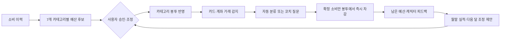
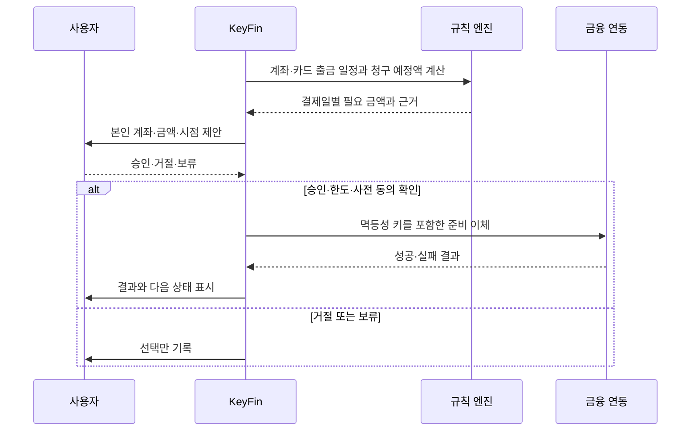

# KeyFin 발표 설계

발표 길이 가정: 7분(420초)
기준 문서: [KeyFin 기획 v2](KeyFin_기획v2.md)
화면 자료: `06/assets/wireframe-*.png`

## 발표 목표

KeyFin을 기능 목록으로 나열하지 않고 사용자가 **이번 달에 얼마를 써도 되는지 알고 나갈 돈을 준비하고 지킨 행동을 반복하는 흐름**으로 보여준다.

이번 발표에 적용한 영상 문법은 다음과 같다.

> 익숙한 장면 → 지금 방식의 모순 → 당연한 해법의 한계 → 발상 전환 → 작동 원리 → 2차 문제와 보정 → 첫 장면 회수

발표에서는 v2의 제품 방향을 설명하되, 기관 연동이 완료되지 않은 화면은 `설계안` 또는 `모의 실행`으로 표시한다. 와이어프레임의 금액·날짜는 샘플 값이다.

## 전체 흐름 요약

| 장면 | 시간 | 이야기 기능 | 핵심 화면 |
|---:|---:|---|---|
| 1 | 0:00–0:25 | 의지가 아닌 구조라는 훅 | 홈·예산 카드 |
| 2 | 0:25–0:50 | 기록과 소비 변화의 간극 | 월간 리포트 |
| 3 | 0:50–1:20 | 흩어진 지출과 남은 금액 문제 | 자산·예산 화면 |
| 4 | 1:20–1:50 | 미납·연체를 만드는 수동 관리 | 일정·자동이체 개념 화면 |
| 5 | 1:50–2:20 | 문제 재정의와 핵심 반전 | 봉투 예산 + 방 홈 |
| 6 | 2:20–2:55 | 제품 공개 | 방·캐릭터·AI 코치 |
| 7 | 2:55–3:30 | 제안 → 반영 → 차감 → 조정 루프 | 봉투 흐름 |
| 8 | 3:30–4:00 | 정기 지출 자동 준비 | 승인 기반 이체 시퀀스 |
| 9 | 4:00–4:30 | 애매한 소비 분류 보정 | 분류·수정·미확정 |
| 10 | 4:30–5:00 | 원장·실행 안전장치 | 기술 차별점 |
| 11 | 5:00–5:25 | 관리 행동 보상 | 코인·방 꾸미기 |
| 12 | 5:25–5:55 | 경쟁 대비 차별성 | 비교표·루프 |
| 13 | 5:55–6:20 | 핵심 범위와 확장 기능 분리 | MVP·확장 경계 |
| 14 | 6:20–6:45 | 검증 지표 | 이해·관리·안전 |
| 15 | 6:45–7:00 | 첫 장면 회수와 요청 | 홈 화면 |

## 장면별 화면·나레이션 설계

| # | 시간 | 장면·연출 | 화면에 남길 문장 | 나레이션 |
|---:|---|---|---|---|
| 1 | 0:00–0:25 | [홈 와이어프레임](assets/wireframe-home.png)을 크게 보여준다. 예산 카드만 강조한다. | **계획된 소비가 어려운 건 의지가 아니라 구조의 문제입니다.** | “가계부를 켜는 순간은 이미 돈을 쓴 다음입니다. 기록은 과거를 보여주지만 이번 달에 얼마를 더 써도 되는지와 나갈 돈을 언제 준비해야 하는지는 바로 알려주지 않습니다.” |
| 2 | 0:25–0:50 | [월간 리포트](assets/wireframe-report.png)의 그래프와 분석 카드를 보여준 뒤 화면을 멈춘다. | **기록과 반성만으로는 다음 소비가 달라지지 않습니다.** | “부지런히 기록해도 사용자는 다시 숫자를 읽고 다음 행동을 정해야 합니다. 기록하지 않으면 보완도 없습니다. 돈 관리에 필요한 건 과거의 장부가 아니라 다음 소비 전에 도착하는 판단 근거입니다.” |
| 3 | 0:50–1:20 | [자산](assets/wireframe-assets.png)과 [예산](assets/wireframe-budget.png)을 좌우로 배치한다. 계좌·카드·예정 지출을 선으로 연결한다. | **지출은 흩어져 있고 남은 예산은 한곳에 없습니다.** | “소비 금액과 시점은 일정하지 않고 여러 카드와 계좌에 흩어져 있습니다. 월세, 통신비, 구독료와 카드 대금도 서로 다른 날 빠져나갑니다. 그래서 사용자는 결제수단을 넘나들며 남은 금액을 다시 계산합니다.” |
| 4 | 1:20–1:50 | 캘린더에 출금일을 표시하고 부족한 결제 계좌로 화살표를 그린다. 실제 송금 화면은 사용하지 않는다. | **알림을 받아도 잔액 확인과 이체는 사람의 몫입니다.** | “결제일마다 수입 계좌에서 돈을 옮기는 일을 놓치면 미납과 연체가 됩니다. 단순 알림은 날짜를 알려줄 뿐입니다. 우리는 언제, 어느 계좌에, 얼마가 필요한가를 계산해 준비하는 단계까지 연결하려고 합니다.” |
| 5 | 1:50–2:20 | 빈 방에 7개 봉투 아이콘과 남은 예산 카드를 넣고 [홈 화면](assets/wireframe-home.png)으로 전환한다. | **가계부를 더 채우는 대신, 소비가 일어나는 순간 봉투를 바꿉니다.** | “KeyFin은 문제를 다시 정의합니다. 기록을 잘하게 만드는 앱이 아니라, 소비가 발생할 때 카테고리별 봉투에서 바로 차감하고 남은 예산을 보여주는 앱입니다. 여기에 나갈 돈을 미리 준비하고 지킨 행동을 보상하는 루프를 붙입니다.” |
| 6 | 2:20–2:55 | [전체 와이어프레임](assets/wireframe-overview.png)에서 방, 벽 보드, 캘린더와 캐릭터를 차례로 확대한다. | **방은 상태판이고 캐릭터는 코치입니다.** | “홈 화면은 내 방입니다. 벽 보드에는 예산 진행률을, 캘린더에는 출금 일정을 보여줍니다. 아바타는 쇼핑백이나 약봉투처럼 소비 카테고리에 맞춰 반응하고 AI 고양이 코치는 도도냥·온순냥·지방냥처럼 선택한 말투로 다음 행동을 묻고 설명합니다.” |
| 7 | 2:55–3:30 | 봉투 루프를 한 단계씩 점등한다. 7개 카테고리, 사용자 승인, 결제 직후 차감을 순서대로 보여준다. | **제안 → 승인·조정 → 반영 → 결제 직후 차감 → 다음 달 조정** | “계좌와 카드 거래를 자동 수집해 7개 카테고리로 분류합니다. 소비 패턴에서 나온 카테고리별 예산 후보를 AI가 제안하고 사용자가 승인하거나 조정합니다. 결제가 발생하면 결제수단과 관계없이 해당 봉투에서 즉시 차감합니다. 월말에는 실적을 모아 다음 달 예산 조정을 다시 제안합니다.” |
| 8 | 3:30–4:00 | 정기 지출 카드에 출금 일정·필요 금액·대상 계좌를 표시한다. 승인 뒤 `준비 완료` 상태를 보여준다. | **본인이 지정한 본인 계좌 간, 정기 지출을 미리 준비합니다.** | “정기 결제, 구독, 카드 대금과 대출 이자의 출금 일정과 필요 금액을 한곳에 모읍니다. 매일 청구 예정액을 계산해 결제일 전에 필요한 금액을 제안하고 사용자가 정한 본인 계좌 사이에서 준비 이체를 진행합니다. 자동화의 목적은 소비를 막는 것이 아니라 미납을 예방하는 것입니다.” |
| 9 | 4:00–4:30 | 소비 분류 결과를 `확정`, `수정`, `미확정` 세 카드로 나눈다. 저녁 일괄 정리 버튼을 마지막에 보여준다. | **모르면 추측하지 않고 확인된 소비만 봉투에 넣습니다.** | “애매한 결제는 코치가 먼저 묻습니다. 신뢰도가 높으면 분류 결과를 보여주고 사용자가 수정할 수 있게 합니다. 낮으면 미확정으로 남기고 저녁에 한 번에 정리합니다. 사용자의 답은 다음 분류를 개선하는 데이터가 되지만 확정되기 전에는 예산에 반영하지 않습니다.” |
| 10 | 4:30–5:00 | 기술 차별점 네 가지를 한 카드씩 보여준다. 마지막에 중복 차감과 무승인 실행에 금지 표시를 남긴다. | **돈을 움직이는 경로와 설명하는 경로를 분리합니다.** | “체크카드, 신용카드와 이체가 섞여도 한 소비가 한 봉투에 한 번만 들어가도록 원장을 대사합니다. 취소, 더치페이와 선결제 예외도 다룹니다. 결제 준비 스케줄러는 필요한 금액을 예측하고 이체는 사전 동의·한도·기관 거래 고유번호 기반 멱등성으로 보호합니다. 금액과 판정은 결정론적 계산으로 고정하고 LLM은 제안과 코칭을 담당합니다.” |
| 11 | 5:00–5:25 | 코인 표시와 방 꾸미기 화면을 연결한다. 일·주·월 보상 배지를 차례로 보여준다. | **금액이 아니라, 지켰는가를 보상합니다.** | “출석, 카테고리 정리와 예산 준수에 일·주·월 단위 코인을 지급합니다. 코인은 방과 캐릭터를 꾸미는 데 씁니다. 결제 금액이 아니라 관리 행동을 보상하므로 소득 규모와 관계없이 같은 규칙을 적용할 수 있습니다.” |
| 12 | 5:25–5:55 | 경쟁 서비스의 공통 기능을 한 줄씩 보여준 뒤 KeyFin의 루프만 색으로 남긴다. | **차별점은 캐릭터가 아니라, 행동까지 이어지는 봉투 루프입니다.** | “토스 자산관리는 통합과 알림에서 멈추지만 KeyFin은 부족액을 계산해 승인 기반 준비 이체까지 연결합니다. 토스 혜택의 보상은 금융 관리와 무관하지만 KeyFin의 반응과 코인은 소비·예산 데이터가 근거입니다. 뱅크샐러드와 카카오페이의 대화형 안내, YNAB의 봉투 철학과 겹치는 지점은 인정하되, KeyFin은 제안·반영·차감·조정과 결제 준비를 한 루프로 묶습니다.” |
| 13 | 5:55–6:20 | `핵심`과 `확장`을 두 칸으로 나눈다. 확장 기능은 흐리게 표시한다. | **핵심 루프를 먼저 검증하고 맞춤 추천은 확장합니다.** | “핵심은 7개 봉투 예산, 결제 직후 차감, 정기 지출 준비, 방·캐릭터·AI 코칭과 관리 행동 보상입니다. 사용자 조건에 맞는 지원 정책과 금융 상품 추천은 확장 기능으로 분리합니다. 기관 연동과 실제 이체 범위가 확정되기 전에는 설계안 또는 모의 실행으로 구분합니다.” |
| 14 | 6:20–6:45 | 지표를 `이해`, `관리`, `안전` 세 묶음으로 배치한다. 중복 차감·승인 없는 실행 행을 강조한다. | **이해했는가, 관리했는가, 안전했는가.** | “남은 예산을 보고 다음 소비를 판단했는지, 결제 직후 차감과 분류 수정을 완료했는지, 정기 지출 준비를 놓치지 않았는지를 확인합니다. 기술적으로는 한 소비 한 봉투 한 번의 정합성, 중복 차감 0건, 승인 없는 실행 0건을 검증합니다.” |
| 15 | 6:45–7:00 | 1번 장면의 홈 화면으로 돌아온다. 예산 봉투와 캐릭터를 동시에 밝힌다. | **기록하는 가계부에서, 계획적인 소비를 만드는 생활 금융 관리로.** | “처음에는 돈을 쓴 뒤 기록하고 다시 계산해야 했습니다. KeyFin은 소비 직후 봉투를 바꾸고 나갈 돈을 미리 챙기고 지킨 행동을 방과 캐릭터에 남깁니다. 이번 검증의 질문은 하나입니다. 이 짧은 루프가 계획적인 소비 습관을 실제로 만드는가입니다.” |

## 장면 7의 봉투 예산 루프

발표에서 역할은 다음처럼 고정한다.

| 역할 | 담당 |
|---|---|
| 원장·규칙 엔진 | 거래 대사, 카테고리 판정, 봉투 차감, 예산·청구 예정액 계산 |
| AI 코치 | 계산 결과를 쉬운 말로 설명하고 예산·행동을 제안하며 애매한 소비를 질문 |
| 사용자 | 예산 승인·조정, 분류 수정, 이체 승인·거절 선택 |
| 금융 연동 | 사용자가 지정한 본인 계좌 간 승인된 정기 지출 준비를 실행하고 결과 반환 |

## 장면 8의 정기 지출 준비 시퀀스

## 발표자가 지킬 표현

| 말할 것 | 피할 것 |
|---|---|
| “본인이 지정한 본인 계좌 간 정기 지출을 준비합니다.” | “모든 계좌의 돈을 자동으로 옮깁니다.” |
| “AI는 계산 근거를 설명하고 제안합니다.” | “AI가 임의로 최적 금액을 계산합니다.” |
| “애매한 소비는 미확정으로 두고 묻습니다.” | “모든 소비를 정확히 자동 분류합니다.” |
| “결제 직후 확정된 봉투에서 차감합니다.” | “카드와 계좌 내역을 무조건 한 번씩 차감합니다.” |
| “화면의 금액과 날짜는 샘플 값입니다.” | “실제 사용자의 금융 상태입니다.” |
| “기관 연동 전 결과는 설계안 또는 모의 실행입니다.” | “실제 자동이체가 완료됐습니다.” |

## 발표 전 체크리스트

- 첫 25초 안에 `계획된 소비가 어려운 건 의지가 아니라 구조의 문제`를 말한다.
- 제품 공개 전까지 캐릭터 기능을 나열하지 않고 기록과 다음 행동 사이의 빈 단계를 유지한다.
- 1:50 전후에 문제를 `기록 부족`에서 `봉투 차감과 행동 연결`로 재정의한다.
- 7개 카테고리 예산의 `AI 제안 → 사용자 승인·조정 → 결제 직후 차감 → 월말 조정`을 한 화면에서 보여준다.
- 정기 지출 장면에서 계좌·금액·시점·근거·승인과 `본인 계좌 간` 범위를 모두 말한다.
- 분류 장면에서 `미확정`, 사용자 수정과 저녁 일괄 정리 경로를 빼지 않는다.
- 원장 정합성, 중복 차감 방지, 이체 멱등성과 사전 동의를 기술 차별점으로 설명한다.
- 맞춤 정책·금융 상품 추천은 확장 기능으로 분리한다.
- 실제 연동과 모의 실행을 같은 문장에 섞지 않는다.
- 마지막 15초에 첫 홈 화면과 MVP 검증 질문을 다시 보여준다.

## 근거 문서

- [KeyFin 기획 v2](KeyFin_기획v2.md)
- [KeyFin 기획 원본](KeyFin_기획.md)
- [와이어프레임 전체](assets/wireframe-overview.png)
- [홈](assets/wireframe-home.png), [자산](assets/wireframe-assets.png), [예산](assets/wireframe-budget.png), [월간 리포트](assets/wireframe-report.png)
- [신비한 건축사전 영상 패턴 분석](RESEARCH/mysterious-architecture-channel_2026-09-02/report.md)
