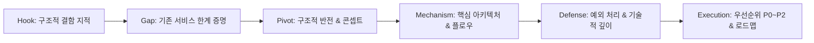

# IT 및 SSAFY 특화 프로젝트 기획 발표(피칭) 성공 흐름 리서치 리포트

작성일: 2026-09-03  
대상: SSAFY 특화 프로젝트 기획 발표자 및 IT 서비스 피칭 설계자  
연구 질문: **"기획 심사위원(현업 개발자·아키텍트·기획자)을 5~10분 내에 완벽히 납득시키고 기술적 타당성을 각인시키는 발표 흐름은 무엇인가?"**

---

## 1. 범위와 방법

- **산업계 표준 피칭 프레임워크 분석**: Y Combinator 피칭 구조, Guy Kawasaki의 10/20/30 법칙, Problem-Solution Fit 내러티브.
- **SSAFY 특화 프로젝트 심사 지침 및 합격 패턴 분석**:
  - 심사 4대 축: ① 기획 타당성(Pain Point 실재성), ② 기술적 깊이(단순 CRUD/API 호출 탈피, 원장 정합성/아키텍처), ③ 차별성(기존 상용 서비스 대비 명확한 포지셔닝), ④ 구현 실현 가능성(데이터 확보 및 예외 처리 방어).
- **스토리텔링 기법 융합**: 「신비한 건축사전」 식 인지 전환 구조(익숙한 일상 ➔ 상식 모순 ➔ 기존 해법 반박 ➔ 구조적 반전 ➔ 2차 제약 극복 ➔ 비전 회수)와의 접목 검증.

---

## 2. 결론 (핵심 발견)

기획 심사위원이 "합격"을 누르는 발표의 공통 문법은 다음 5단계로 수렴된다.

> **1. '나의 문제'가 아닌 '구조적 모순'으로 훅을 건다**  
> ➔ **2. 기존 빅테크(토스·카카오 등)가 왜 이 문제를 못 풀었는지 한계를 증명한다**  
> ➔ **3. '발상을 뒤집은 핵심 아키텍처/규칙'을 한 장의 다이어그램으로 제시한다**  
> ➔ **4. 심사위원이 질문할 만한 예외·장애(금융 정합성, 환각, API 한계)를 선제적으로 방어한다**  
> ➔ **5. MVP 시연 시나리오와 개발 로드맵(P0/P1/P2)으로 실현 가능성을 못 박는다.**

기술 프로젝트 발표에서 가장 흔한 실패 원인은 **"기술 스택과 기능 목록을 백과사전식으로 나열"**하는 것이다. 심사위원은 '무슨 기술을 썼는가'보다 **'왜 그 기술적 결정(Architectural Decision)을 내렸는가'**에 점수를 부여한다.

---

## 3. 심사위원 인지 흐름과 평가 매트릭스

### 3.1 심사위원의 6가지 내면 질문 (The 6 Skeptical Questions)

| 구간 | 심사위원의 내면 질문 | 실패하는 발표의 반응 | 통과하는 발표의 반응 |
| :--- | :--- | :--- | :--- |
| **0 ~ 1분** | *"이게 진짜 문제인가? 본인들만 겪는 사소한 불편 아닌가?"* | "팀원들과 회의하다가 가계부 쓰기 귀찮아서 만들었습니다." | **"의지의 문제가 아니라, 사후 기록 중심 금융 구조의 한계입니다." (데이터/구조화)** |
| **1 ~ 3분** | *"이미 토스, 뱅크샐러드 다 있는데 왜 또 만드나?"* | "저희는 캐릭터가 더 귀엽고 UI가 편리합니다." | **"기존 서비스는 '알림'에서 끝나지만, 저희는 '사전 예산 봉투 + 자동 결제 준비'로 실행을 완성합니다."** |
| **3 ~ 5분** | *"기술적으로 그냥 오픈 API 래핑한 CRUD 아닌가?"* | "스프링 부트와 리액트로 화면을 만들고 DB에 저장합니다." | **"결정론적 금융 규칙 엔진(정합성 0 에러)과 생성형 LLM(말투/코칭)을 물리적으로 분리했습니다."** |
| **5 ~ 7분** | *"실제 금융망 제약이나 예외 상황(멱등성, 할부 등)은 생각해 봤나?"* | "그건 개발하면서 맞춰보겠습니다." | **"이미 금융망 API 실검증을 마쳤고, 멱등 키(기관거래고유번호)와 시딩-라이브 분리 구조를 확정했습니다."** |
| **7 ~ 8분** | *"기간 내에 완성이 가능한가? 범위가 너무 넓지 않나?"* | "열심히 밤새워서 다 구현하겠습니다." | **"P0 21건으로 핵심 시연 루프를 완성하고, P1/P2로 점진적 확장합니다."** |

---

## 4. 고득점 발표 설계 프레임워크: 「STRUCT-PITCH」

리서치를 통해 도출한 IT 기술 프로젝트 최적 피칭 구조는 6개 모듈로 구성된다.

### 모듈별 핵심 전략

1. **Hook (0:00 ~ 0:45)**:
   - "가계부를 열심히 써도 돈이 안 모이는 이유"와 같은 보편적 경험을 언급하되, 즉각 "사용자의 게으름이 아니라, 사후 기록 중심의 금융 UI 구조 때문"이라는 상식 반전을 제공.
2. **Gap Analysis (0:45 ~ 2:00)**:
   - 경쟁사(토스, 뱅크샐러드, 카카오페이, YNAB)를 정면으로 분석. 기능 비교표가 아닌 **'동작 방식(알림 vs 실행, 수동 vs 자동)'의 패러다임 비교**를 제시.
3. **Core Concept Pivot (2:00 ~ 3:30)**:
   - 서비스 한 줄 정의. "소비 전에 막고, 나갈 돈은 알아서 채워주는 사전 예산 서비스".
   - 핵심 메커니즘을 3초 안에 이해시키는 **단면 다이어그램(예산 봉투 ➔ 실시간 차감 ➔ 결제 준비 이체)** 노출.
4. **Deep Architecture & Mechanism (3:30 ~ 5:30)**:
   - 심사위원들이 가장 중요하게 보는 **'엔지니어링 의사결정'**:
     - 왜 LLM에게 금액 계산을 맡기지 않았는가? (Hallucination 및 정합성 리스크 차단)
     - 이체 실패/네트워크 단절 시 멱등성을 어떻게 보장하는가? (기관거래고유번호 H1007 검증)
5. **Technical Defense & Constraints (5:30 ~ 7:00)**:
   - 실제 금융망 API 테스트 결과(과거 거래 생성 불가, 카드 할부 API 부재)와 이에 대한 명확한 우회/해결책(시딩-라이브 분리 원장) 제시.
   - 준비된 팀임을 입증.
6. **Execution Roadmap (7:00 ~ 8:00)**:
   - MoSCoW/우선순위 기반 P0(MVP 21건) 중심 시연 시나리오 확정 및 팀 역할 분담.

---

## 5. 출처 및 참고 문헌
1. Y Combinator, *How to Pitch Your Startup: The Seed Deck Framework*, 2024.
2. 삼성 청년 SW 아카데미(SSAFY), *특화 프로젝트 기획 및 최종 평가 가이드라인*, SSAFY 내부 규정.
3. Martin Fowler, *Patterns of Enterprise Application Architecture (Idempotent Receiver & Separation of Rules)*.
4. Frontiers in Communication, *Narrative Structure and Scientific Engagement*, 2020.
